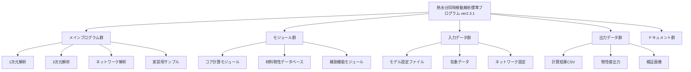
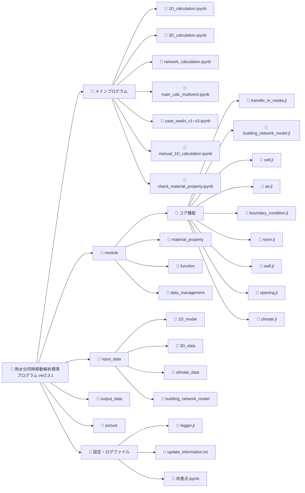
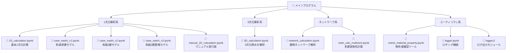
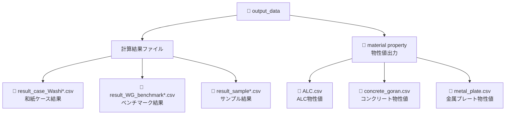
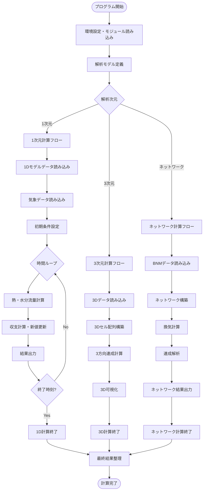
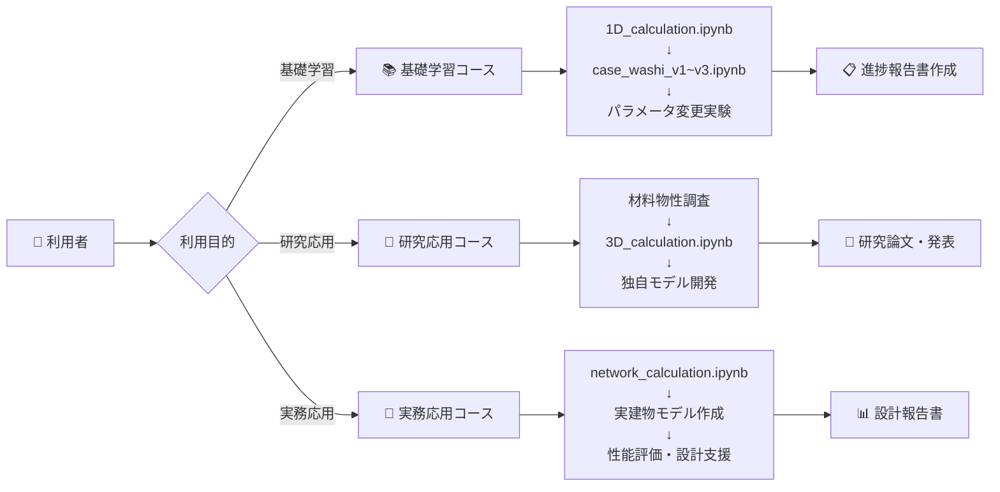
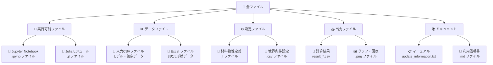

# 熱水分同時移動解析標準プログラム ver2.3.1 ディレクトリ構造図

## 全体構造概要

## 詳細ディレクトリ構造

## メインプログラム詳細構造

## モジュール詳細構造

```mermaid
graph TD
    Mod[📁 module] --> CoreMod[コア計算モジュール]
    Mod --> MatProp[📁 material_property<br/>材料物性データベース]
    Mod --> FuncMod[📁 function<br/>数値計算関数群]
    Mod --> DataMod[📁 data_management<br/>データ管理]
    
    CoreMod --> CM1[📄 transfer_in_media.jl<br/>💡 熱・水分移動計算<br/>フーリエ・フィック法則]
    CoreMod --> CM2[📄 building_network_model.jl<br/>🏢 建物全体モデル<br/>BNM構造体定義]
    CoreMod --> CM3[📄 cell.jl<br/>🔳 計算セル定義<br/>Cell構造体・基本操作]
    CoreMod --> CM4[📄 air.jl<br/>💨 空気状態管理<br/>温湿度状態の計算]
    CoreMod --> CM5[📄 boundary_condition.jl<br/>🚪 境界条件設定<br/>Robin・Neumann・Dirichlet]
    CoreMod --> CM6[📄 room.jl<br/>🏠 室内空間管理]
    CoreMod --> CM7[📄 wall.jl<br/>🧱 壁体構造管理]
    CoreMod --> CM8[📄 opening.jl<br/>🚪 開口・隙間管理]
    CoreMod --> CM9[📄 climate.jl<br/>🌤️ 外界気象管理]
    
    MatProp --> Traditional[伝統材料群]
    MatProp --> Modern[現代材料群]
    MatProp --> Special[特殊材料群]
    
    Traditional --> T1[📄 mud_wall.jl<br/>土壁物性]
    Traditional --> T2[📄 paper_washi*.jl<br/>和紙各種]
    Traditional --> T3[📄 tuff_motomachi*.jl<br/>凝灰岩]
    
    Modern --> M1[📄 concrete_goran.jl<br/>コンクリート]
    Modern --> M2[📄 ALC.jl<br/>軽量コンクリート]
    Modern --> M3[📄 glass_wool*.jl<br/>グラスウール]
    Modern --> M4[📄 plywood*.jl<br/>合板類]
    
    Special --> S1[📄 liquid_water.jl<br/>液体水]
    Special --> S2[📄 van_genuchten.jl<br/>土壌モデル]
    Special --> S3[📄 benchmark_EN15026.jl<br/>国際標準材料]
    
    FuncMod --> F1[📄 flux_and_balance_equation.jl<br/>流量・収支計算]
    FuncMod --> F2[📄 lewis_relation.jl<br/>Lewis関係式]
    FuncMod --> F3[📄 vapour.jl<br/>水蒸気物性]
```

## 入力データ詳細構造

```mermaid
graph TD
    Input[📁 input_data] --> OneDData[📁 1D_model<br/>1次元モデル設定]
    Input --> ThreeDData[📁 3D_data<br/>3次元データ]
    Input --> ClimateData[📁 climate_data<br/>気象データ]
    Input --> BNMData[📁 building_network_model<br/>ネットワーク設定]
    
    OneDData --> OD1[📄 case_washi_v1.csv<br/>和紙v1モデル]
    OneDData --> OD2[📄 case_washi_v2.csv<br/>和紙v2モデル]
    OneDData --> OD3[📄 case_washi_v3.csv<br/>和紙v3モデル]
    OneDData --> OD4[📄 wall*.csv<br/>壁体構成ファイル]
    OneDData --> OD5[📄 WG_benchmark*.csv<br/>検証用データ]
    
    ThreeDData --> TD1[📁 2D_property_data<br/>2次元断面データ]
    ThreeDData --> TD2[📄 dx_data.csv<br/>X軸分割情報]
    ThreeDData --> TD3[📄 dy_data.csv<br/>Y軸分割情報]
    ThreeDData --> TD4[📄 dz_data.csv<br/>Z軸分割情報]
    ThreeDData --> TD5[📄 property_information.csv<br/>材料特性情報]
    ThreeDData --> TD6[📄 size_data.xlsx<br/>寸法データ]
    
    ClimateData --> CD1[📁 case_Washi<br/>和紙ケース用気象]
    ClimateData --> CD2[📄 climate_data_*.csv<br/>各地気象データ]
    ClimateData --> CD3[📁 old_data<br/>過去データ]
    
    CD1 --> CD1a[📄 Indoor.csv<br/>室内環境データ]
    CD1 --> CD1b[📄 Airlayer.csv<br/>中空層データ]
    
    BNMData --> BNM1[📄 room_condition.csv<br/>室条件設定]
    BNMData --> BNM2[📄 wall_condition.csv<br/>壁条件設定]
    BNMData --> BNM3[📄 opening_condition.csv<br/>開口条件設定]
    BNMData --> BNM4[📁 cell_data<br/>セル詳細データ]
    
    BNM4 --> BNM4a[📄 wall*.csv<br/>壁体詳細構成]
    BNM4 --> BNM4b[📄 ceiling*.csv<br/>天井構成]
    BNM4 --> BNM4c[📄 floor*.csv<br/>床構成]
    BNM4 --> BNM4d[📄 roof*.csv<br/>屋根構成]
```

## 出力データ構造

## 計算フロー図

## プログラム利用者向け構造図

## ファイル機能分類

---

## 補足説明

### アイコンの意味
- 📁: フォルダ
- 📓: Jupyter Notebook
- 📄: Juliaファイル・CSVファイル
- 🔧: 実行可能プログラム
- 📊: データファイル
- 🏢: 建物・ネットワーク関連
- 💡: 計算アルゴリズム
- 🌤️: 気象・環境関連

### 重要度による色分け
- **赤色**: 最重要（初学者が最初に触るファイル）
- **青色**: 重要（応用・発展学習用）
- **緑色**: 補助（設定・データファイル）
- **灰色**: 参考（ドキュメント・ログ）

この構造図により、プログラムの全体像と各ファイルの役割・関係性を視覚的に理解できます。