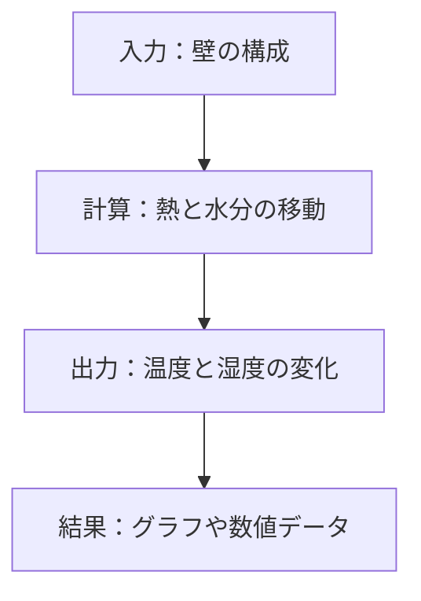

# 熱水分同時移動解析プログラム 初学者向け実習手順書

## はじめに

**「教授から触ってみてと言われた」あなたへ**

この手順書は、熱水分同時移動解析標準プログラム ver2.3.1を初めて使用する学生向けの実践的なガイドです。この手順に従えば、プログラムの基本的な使い方を習得し、教授への進捗報告ができるようになります。

### 学習目標
1. プログラムの基本概念を理解する
2. 簡単な1次元解析を実行できるようになる
3. 結果を解釈・可視化できるようになる
4. 進捗を適切に報告できるようになる

---

## 第1段階：環境準備（所要時間：30分）

### 1.1 Juliaのインストール確認

**Julia言語がインストールされているか確認**
```bash
# ターミナル/コマンドプロンプトで実行
julia --version
```

**結果例:**
```
julia version 1.8.5
```

**インストールされていない場合:**
1. [Julia公式サイト](https://julialang.org/downloads/)からダウンロード
2. インストール後、再度バージョン確認

### 1.2 必要パッケージのインストール

**Juliaを起動し、以下を実行:**
```julia
using Pkg
Pkg.add("CSV")
Pkg.add("DataFrames")
Pkg.add("Dates")
Pkg.add("Plots")
```

**成功確認:**
```julia
using CSV, DataFrames, Dates, Plots
println("パッケージの読み込み成功！")
```

### 1.3 プログラムフォルダの確認

**フォルダ構成を確認（重要なフォルダのみ）:**
```
[Julia]熱水分同時移動解析標準プログラムver2.3.1/
├── 1D_calculation.ipynb          # ← これを最初に使います
├── module/                       # ← 計算に必要なモジュール
├── input_data/                   # ← 入力データ
│   ├── 1D_model/                # ← 1次元モデル設定
│   └── climate_data/            # ← 気象データ
└── output_data/                 # ← 結果が保存される場所
```

**進捗報告ポイント①:**
> 「環境準備が完了しました。Juliaとパッケージをインストールし、プログラムフォルダの構成を確認しました。」

---

## 第2段階：プログラムの基本概念理解（所要時間：20分）

### 2.1 このプログラムが何をするのか

**簡単に言うと:**
- 壁の中を熱と水分がどう移動するかを計算
- 結露が起きるかどうかを予測
- 建物の湿気問題を事前に検討

**例えばこんなとき役立つ:**
- 「この壁構成だと結露しないかな？」
- 「和紙と土壁の湿気特性ってどう違うんだろう？」
- 「断熱材の位置を変えたら何が変わる？」

### 2.2 基本的な計算の流れ



### 2.3 使用する用語の基本理解

| 用語 | 意味 | 単位 |
|------|------|------|
| 温度 | 材料の温かさ | ℃ (または K) |
| 相対湿度 | 空気中の水分の割合 | % |
| 含水率 | 材料中の水分量 | kg/kg |
| 熱伝導率 | 熱の伝わりやすさ | W/m·K |

**進捗報告ポイント②:**
> 「プログラムの目的と基本概念を理解しました。壁体内の熱・水分移動を数値解析するプログラムであることを確認しました。」

---

## 第3段階：最初の計算実行（所要時間：45分）

### 3.1 サンプル計算の実行

**手順:**
1. Jupyter Notebookまたは Julia REPL を起動
2. プログラムフォルダに移動
3. `1D_calculation.ipynb`を開く

**Jupyter Notebookの場合:**
```bash
# プログラムフォルダで実行
jupyter notebook
```

**Julia REPLの場合:**
```julia
# フォルダ移動
cd("プログラムのパス")

# ファイル実行
include("1D_calculation.ipynb")  # ← これはエラーになります
```

**注意:** `.ipynb`ファイルはJupyter Notebook形式なので、Julia REPLでは直接実行できません。

### 3.2 手動実行（推奨）

**1D_calculation.ipynbの内容を段階的に実行:**

#### ステップ1: モジュール読み込み
```julia
using Dates
include("./module/building_network_model.jl")
include("./module/transfer_in_media.jl")
include("./logger.jl")
```

**確認ポイント:** エラーなく読み込めるか

#### ステップ2: モデル設定
```julia
target_model = input_cell_data("./input_data/1D_model/case_washi_v1.csv")
```

**確認ポイント:** `target_model`が11要素の配列になっているか

#### ステップ3: 計算条件設定
```julia
dt = 0.01  # 時間刻み（秒）
date_calc = DateTime(2023,7,18,11,00,00)  # 開始時刻
end_date = DateTime(2023,7,18,12,00,00)   # ← 最初は1時間だけに短縮
```

**注意:** 最初は短時間で試しましょう

#### ステップ4: 気象データ読み込み
```julia
climate_data_in = input_climate_data(
    file_name = "./input_data/climate_data/case_Washi/Indoor.csv", 
    header = 3
)

climate_data_out = input_climate_data(
    file_name = "./input_data/climate_data/case_Washi/Airlayer.csv", 
    header = 3
)
```

### 3.3 エラーが発生した場合の対処

#### よくあるエラーと対処法

**1. ファイルが見つからない**
```julia
# エラー例
ERROR: SystemError: opening file "./input_data/...": No such file or directory

# 対処法：現在のディレクトリを確認
pwd()
```

**2. 関数が定義されていない**
```julia
# エラー例
ERROR: UndefVarError: input_cell_data not defined

# 対処法：モジュールを正しく読み込む
include("./module/building_network_model.jl")
```

**3. データ形式エラー**
```julia
# 対処法：CSVファイルの中身を確認
using CSV
df = CSV.read("./input_data/1D_model/case_washi_v1.csv", DataFrame)
first(df, 5)  # 最初の5行を表示
```

**進捗報告ポイント③:**
> 「最初の計算実行を試みました。[成功/エラー発生]しました。[エラーの場合は]○○エラーが発生しましたが、原因は○○と考えられます。」

---

## 第4段階：結果の確認と理解（所要時間：30分）

### 4.1 計算が成功した場合

**結果ファイルの確認:**
```julia
# 出力フォルダの確認
readdir("./output_data/")
```

**CSV ファイルの読み込み:**
```julia
using CSV, DataFrames
result = CSV.read("./output_data/result_case_Washi_v1.csv", DataFrame)
first(result, 10)  # 最初の10行を表示
```

### 4.2 結果の可視化

**簡単なグラフ作成:**
```julia
using Plots

# 時間を横軸にした温度変化のグラフ
plot(result.temp_2, label="セル2の温度", xlabel="時間ステップ", ylabel="温度[K]")
plot!(result.temp_5, label="セル5の温度")
plot!(result.temp_8, label="セル8の温度")
```

**相対湿度の変化:**
```julia
plot(result.rh_2, label="セル2の相対湿度", xlabel="時間ステップ", ylabel="相対湿度[-]")
plot!(result.rh_5, label="セル5の相対湿度")
plot!(result.rh_8, label="セル8の相対湿度")
```

### 4.3 結果の物理的意味

**確認すべきポイント:**
1. **温度変化**: 室内から外気に向かって段階的に変化しているか？
2. **湿度分布**: 材料中で湿度がどう分布しているか？
3. **時間変化**: 時間とともにどう変化しているか？

**正常な結果の例:**
- 温度：室内（20℃）→ 材料中 → 外気（30℃前後）
- 湿度：比較的滑らかな変化
- 異常な値（負の湿度、極端な温度）がない

### 4.4 トラブルシューティング

**計算が異常終了した場合:**
1. **時間刻みを大きくする**: `dt = 0.1` に変更
2. **計算期間を短くする**: 10分程度に設定
3. **ログを確認**: エラーメッセージを記録

**結果が物理的におかしい場合:**
1. **初期条件の確認**: 入力データの温度・湿度が適切か
2. **材料物性の確認**: 材料名が正しく設定されているか
3. **境界条件の確認**: 室内外の条件が適切か

**進捗報告ポイント④:**
> 「計算結果を確認しました。[温度・湿度の分布について簡潔に説明]。結果は物理的に[妥当/疑問点があります]。」

---

## 第5段階：パラメータ変更実験（所要時間：30分）

### 5.1 簡単なパラメータ変更

**実験1: 計算時間の変更**
```julia
# 計算期間を3時間に延長
end_date = DateTime(2023,7,18,14,00,00)
```

**実験2: 時間刻みの変更**
```julia
# より粗い時間刻み
dt = 0.1
```

**実験3: 異なるケースの実行**
```julia
# 別のサンプルファイル
target_model = input_cell_data("./input_data/1D_model/case_washi_v2.csv")
```

### 5.2 結果の比較

**v1とv2の比較:**
```julia
# 2つの結果を同じグラフに表示
plot(result_v1.temp_5, label="v1 中央温度")
plot!(result_v2.temp_5, label="v2 中央温度")
```

### 5.3 物理的解釈

**変更による影響を考察:**
1. **材料構成の違い**: v1（単層）とv2（多層）の差
2. **時間刻みの影響**: 計算精度への影響
3. **境界条件の影響**: 室内外条件の変化

**進捗報告ポイント⑤:**
> 「パラメータを変更した実験を行いました。[具体的な変更内容]により、[観察された変化]が確認できました。」

---

## 第6段階：応用的な理解（所要時間：45分）

### 6.1 入力データの理解

**CSVファイルの中身を詳しく見る:**
```julia
# 1次元モデルファイルの構造
model_data = CSV.read("./input_data/1D_model/case_washi_v1.csv", DataFrame)
println(names(model_data))  # 列名を表示
println(model_data)         # 全データを表示
```

**各列の意味:**
- `type`: セルのタイプ（BC_Robin=境界、Cell=材料）
- `name`: 材料名
- `dx`: セルの幅 [m]
- `temp`: 初期温度 [℃]
- `rh`: 初期相対湿度 [-]

### 6.2 材料物性の確認

**利用可能な材料一覧:**
```julia
# material_propertyフォルダの内容確認
readdir("./module/material_property/")
```

**特定の材料の物性値確認:**
```julia
# 和紙の物性値を確認（もしmoduleが読み込まれていれば）
# 実際の関数名は実装により異なる可能性があります
```

### 6.3 3次元計算への挑戦（オプション）

**簡単な3次元計算:**
```julia
# 3D_calculation.ipynbの一部を実行
# ※これは上級者向けです
```

### 6.4 建物全体計算への挑戦（オプション）

**ネットワーク計算の概要理解:**
```julia
# network_calculation.ipynbの概要を確認
# ※これも上級者向けです
```

**進捗報告ポイント⑥:**
> 「入力データの構造を理解し、[具体的な発見や理解]しました。[応用計算にも挑戦した場合は]3次元計算/ネットワーク計算についても[簡潔な感想]。」

---

## 第7段階：結果のまとめと報告準備（所要時間：30分）

### 7.1 習得内容の整理

**技術的な習得内容:**
- [ ] Juliaプログラムの基本的な実行
- [ ] 1次元熱水分移動計算の実行
- [ ] CSVデータの読み込みと可視化
- [ ] パラメータ変更実験の実施
- [ ] 結果の物理的解釈

**理解した概念:**
- [ ] 熱・水分同時移動の基本概念
- [ ] 材料物性の重要性
- [ ] 境界条件の設定方法
- [ ] 数値計算の基本的な流れ

### 7.2 発見した問題や疑問

**記録しておくべき項目:**
- 実行時に発生したエラーとその解決方法
- 結果で理解できなかった部分
- さらに調べたい材料や条件
- プログラムの改善提案

### 7.3 進捗報告書の作成

**報告書テンプレート:**

```markdown
# 熱水分同時移動解析プログラム 実習報告

## 実施内容
- 実習期間：[開始日]〜[終了日]
- 使用プログラム：熱水分同時移動解析標準プログラム ver2.3.1
- 実行したケース：[具体的なファイル名]

## 習得したスキル
1. [具体的なスキル1]
2. [具体的なスキル2]
3. [具体的なスキル3]

## 実験結果
### 基本ケース（case_washi_v1）
- 計算時間：[実際の時間]
- 温度分布：[簡潔な説明]
- 湿度分布：[簡潔な説明]

### パラメータ変更実験
- 変更内容：[具体的な変更]
- 観察結果：[変化の説明]

## 理解した物理現象
- [具体的な物理現象の説明]

## 今後の課題・疑問
1. [疑問点1]
2. [疑問点2]
3. [今後調べたいこと]

## 感想
[プログラムを使ってみた感想、難しかった点、面白かった点など]
```

**進捗報告ポイント⑦（最終）:**
> 「熱水分同時移動解析プログラムの基本的な使用方法を習得しました。1次元計算を実行し、結果の可視化・解釈ができるようになりました。今後は[具体的な学習計画]を進めたいと考えています。」

---

## 補足情報

### よくある質問（FAQ）

**Q1: 計算がとても遅いのですが？**
A: `dt`（時間刻み）を大きくする（0.01→0.1）、計算期間を短くする、などで改善します。

**Q2: エラーメッセージがよくわからない**
A: エラーメッセージを記録し、指導教員に相談してください。多くの場合、ファイルパスやデータ形式の問題です。

**Q3: 結果の妥当性はどう判断する？**
A: 以下をチェック：
- 温度が物理的な範囲内（-50℃〜100℃程度）
- 相対湿度が0〜1の範囲内
- 時間とともに安定に変化

**Q4: 他の材料で計算したい**
A: `module/material_property/`フォルダ内の材料名を確認し、入力CSVファイルの材料名を変更してください。

### 参考資料

1. **Julia言語**: https://julialang.org/
2. **CSV.jl**: CSVファイル操作
3. **Plots.jl**: グラフ作成
4. **プログラムの更新情報**: update_information.txt

### 次のステップ

**初級者→中級者への道筋:**
1. **材料の変更**: 異なる建築材料での計算
2. **3次元計算**: より複雑な形状での解析
3. **ネットワーク計算**: 建物全体の環境解析
4. **独自モデル作成**: オリジナルの壁構成での計算
5. **理論の学習**: 熱・水分移動の物理的背景

---

**最後に**

このプログラムは建築環境工学の専門的なツールですが、段階的に学習すれば必ず習得できます。わからないことがあれば、遠慮なく指導教員に質問してください。

**成功の鍵:**
- 段階的に進める
- エラーを恐れない
- 結果の物理的意味を考える
- 疑問点を記録する

頑張ってください！