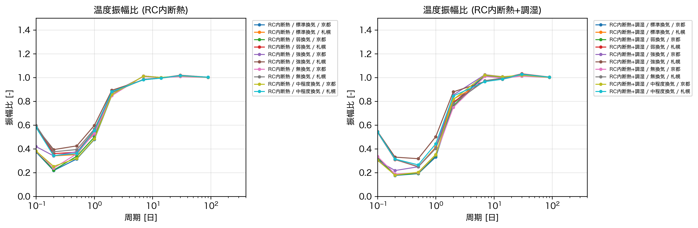
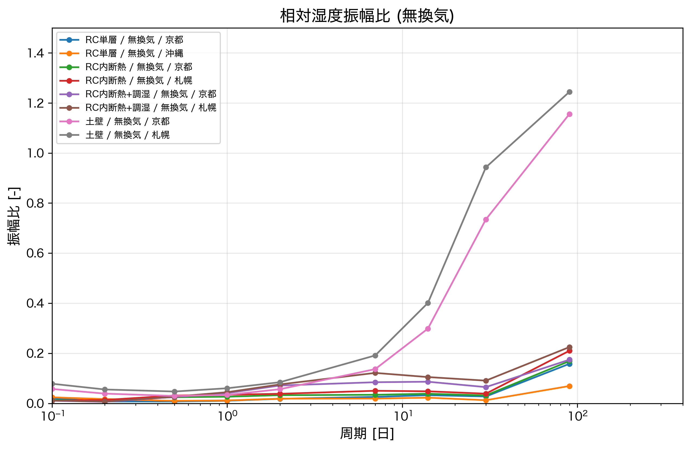
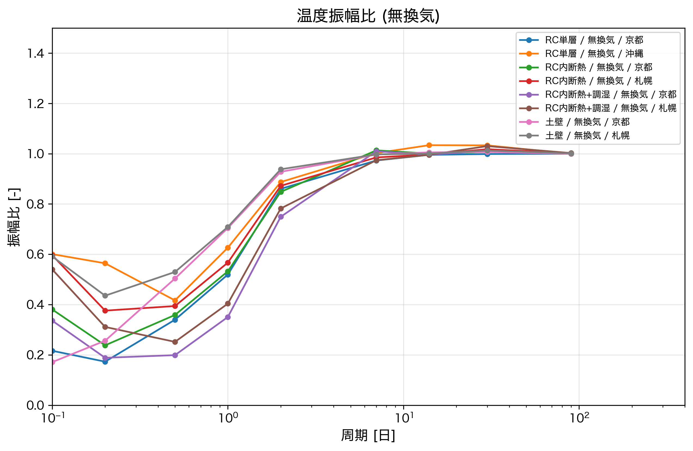

# 考察

## 本章の概要

　本章では、第6章で示した振幅比の解析結果に基づき、建物性能の逆推定に向けた考察を行う。

　第6章の結果から、温度・湿度の振幅比は壁構造や換気量の違いによって異なる傾向を示すことが確認された。しかし、全てのパラメータが明瞭に識別できるわけではなく、条件によっては類似した応答を示すケースも見られた。本章では、これらの結果を詳細に分析し、周波数特徴量から建物性能を逆推定する際の可能性と限界を明らかにする。

　まず7.2節では、個別の解析結果から特徴的な傾向を示すケースを取り上げ、その物理的背景を考察する。続く7.3節では、振幅比を特徴量として用いることで気候条件に依存しない汎化性能が期待できるかを検証する。7.4節では、壁構造・換気量のそれぞれについて、どの周波数帯・どの物理量において識別が可能かを整理する。最後に7.5節では、識別が困難な条件とその要因について議論する。

## 個別事例からの考察

### 短周期における換気量の影響の消失

　図7.1に、各壁構造における温度振幅比を換気量別に示す。いずれの壁構造においても、短周期側（0.1日付近）では換気量が異なっていても振幅比がほぼ同じ値に収束し、地域ごとにグループ化する傾向が見られる。

**図7.1　温度振幅比（壁構造別・全換気量）**

　この現象は、換気による熱交換と壁体表面との熱交換の大きさの違いから説明できる。それぞれの熱交換量を比較すると、

- 換気による熱交換：$c_a \rho_a Q_v \approx 1200 Q_v$ [W/K]
- 壁体表面との熱交換：$\alpha S = 9.3 \times 100 = 930$ [W/K]

となる。本研究の換気量設定（0〜0.020 m³/s）では、換気による熱交換は0〜24 W/K程度であり、壁体表面との熱交換（930 W/K）の1〜3%程度に過ぎない。

　短周期の温度変動に対しては、熱浸透深さが小さいため壁体内部まで熱が伝わらず、壁体表面との対流熱伝達が室温変動を支配する。このとき換気量の寄与は相対的に無視できるほど小さいため、換気量を変えても振幅比がほとんど変化しない。

　一方、長周期になると振幅比は1に収束し、換気量の差も地域差も消失する。これは、十分に長い時間スケールでは室温が外気温の変動にほぼ追従するためである。壁体を通じた熱移動も換気による熱移動も、長期的には室温を外気温に近づける方向に働くため、建物性能によらず振幅比は1に近づく。

　以上より、温度振幅比から換気量を識別できる可能性があるのは、短周期でも長周期でもなく、中間的な周期帯（日周期〜週周期程度）に限られることが示唆される。

### 絶対湿度振幅比における換気量の明確な影響

　図7.2に、京都および札幌における絶対湿度振幅比を壁構造別に示す。各グラフには5種類の換気量パターンが含まれている。

**図7.2a　絶対湿度振幅比（京都・壁構造別）**

**図7.2b　絶対湿度振幅比（札幌・壁構造別）**

　いずれの壁構造・地域においても、換気量の大きい順に振幅比が高くなる傾向が明確に見られる。強換気（緑）が最も上に位置し、無換気（赤）が最も下に位置する。この傾向は短周期から長周期まで全周期帯で一貫している。

　これは前節で示した温度振幅比の結果と対照的である。温度では短周期において換気量の影響が見えなかったのに対し、絶対湿度では全周期帯で換気量の影響が明確に現れている。

　この違いは、壁体の熱伝達特性と湿気伝達特性の差から説明できる。温度の場合、コンクリートを含む全ての壁材が熱容量を持ち、壁体表面との熱交換が支配的であった。一方、絶対湿度の場合、コンクリートなど多くの壁材は吸放湿性が低く、壁体表面との水蒸気交換が相対的に小さい。その結果、換気による水蒸気の流入・流出が室内湿度変動を支配し、換気量の違いが振幅比に明確に反映される。

　以上より、絶対湿度振幅比は温度振幅比に比べて換気量の識別に適した特徴量であることが示唆される。

### 無換気条件における土壁の特異な相対湿度応答

　図7.3に、無換気条件（o04）における相対湿度振幅比を壁構造別に示す。

**図7.3　相対湿度振幅比（無換気条件・壁構造別）**

　RC単層、RC内断熱、RC内断熱+調湿の各壁構造では、相対湿度振幅比は全周期帯で0.2以下の低い値を示している。一方、土壁（ピンク・灰色）のみが長周期側で振幅比が急激に上昇し、1を超える値を示している。

　無換気条件では、換気による水蒸気の流入・流出がないため、室内の絶対湿度は壁体の吸放湿のみで決まる。コンクリートなど吸放湿性の低い壁材では、壁体の吸放湿が小さいため、室内の絶対湿度はほぼ一定に保たれる。このとき室内相対湿度の変動は、温度変化による飽和水蒸気圧の変化のみに起因し、外気の相対湿度変動とは独立した挙動を示す。その結果、振幅比は小さい値となる。

　一方、土壁は高い吸放湿性を有するため、温度変化に応じた吸放湿が生じる。温度が上昇すると飽和水蒸気圧が上がり、壁体内の相対湿度が低下するため、壁体から室内へ水蒸気が放出される。逆に温度が低下すると、壁体が室内から水蒸気を吸収する。この「温度駆動の吸放湿」により、室内の絶対湿度自体が変動し、相対湿度の振幅が増幅される。

　振幅比が1を超えているということは、室内の相対湿度変動が外気の相対湿度変動よりも大きいことを意味する。これは土壁の調湿効果が非常に顕著であることを示しており、無換気条件下では土壁を他の壁構造から明確に識別できる可能性を示唆している。

### 無換気条件における温度振幅比と壁体熱容量の関係

　図7.4に、無換気条件（o04）における温度振幅比を壁構造別に示す。

**図7.4　温度振幅比（無換気条件・壁構造別）**

　短周期から日周期付近（0.1〜2日）において、壁構造による振幅比の差が明確に見られる。土壁（ピンク・灰色）が最も上に位置し振幅比0.5〜0.6程度を示す一方、RC内断熱+調湿（紫・茶色）は最も下に位置し振幅比0.2〜0.35程度となっている。RC単層およびRC内断熱はその中間に位置する。

　この差は壁体の熱容量の違いから説明できる。各壁構造の熱容量（単位面積あたり）を概算すると、

- 土壁（70mm）：$\rho c \cdot d = 1650 \times 900 \times 0.07 \approx 1.0 \times 10^5$ J/(m²·K)
- RC単層（150mm）：$2200 \times 940 \times 0.15 \approx 3.1 \times 10^5$ J/(m²·K)

となり、土壁の熱容量はRC単層の約1/3である。熱容量が小さい壁体は熱を蓄えにくいため、室温が外気温の変動に追従しやすく、振幅比が大きくなる。

　一方、RC内断熱+調湿は総厚が263mmと最も大きく、コンクリート層に加えて石膏ボード等の内装材も含むため、熱容量が大きい。その結果、室温変動が緩和され、振幅比が小さくなる。

　以上より、無換気条件下の温度振幅比は壁体の熱容量を反映しており、特に短周期〜日周期帯において壁構造の識別に有効な特徴量となりうることが示唆される。

## 振幅比の気候条件に対する頑健性

### 異なる気候条件での比較
（京都・沖縄・札幌で同じ壁構造・換気量のときに振幅比の傾向が揃うかを確認。絶対値ではなく比を使うことの妥当性を示す）

### 汎化性能への示唆
（「京都で学習したモデルが沖縄でも使える」可能性についての議論。振幅比を特徴量とすることで気候条件に依存しない逆推定が期待できる）

## 建物性能パラメータの識別可能性

### 壁構造
（壁構造の違いがどの周波数帯・どの物理量に現れるか。識別可能な条件を整理）

### 換気量
（換気量の違いがどの周波数帯・どの物理量に現れるか。識別可能な条件を整理）

## 識別が困難な条件とその要因

### 〇〇〇（仮）
（識別が難しいケースとその物理的要因。具体的な内容は後で決定）

### 〇〇〇（仮）
（識別が難しいケースとその物理的要因。具体的な内容は後で決定）
