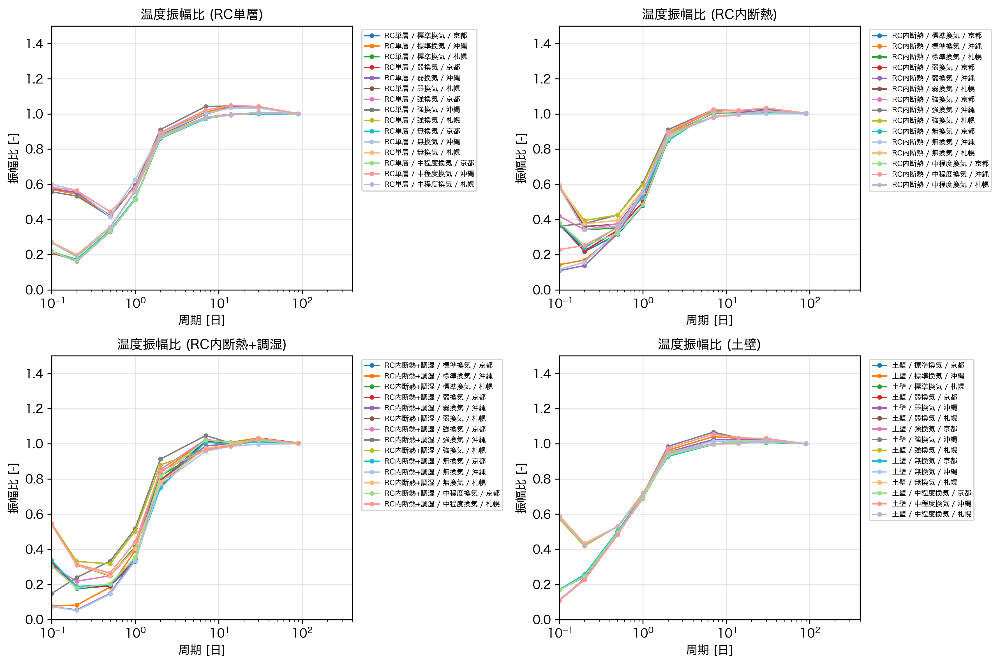
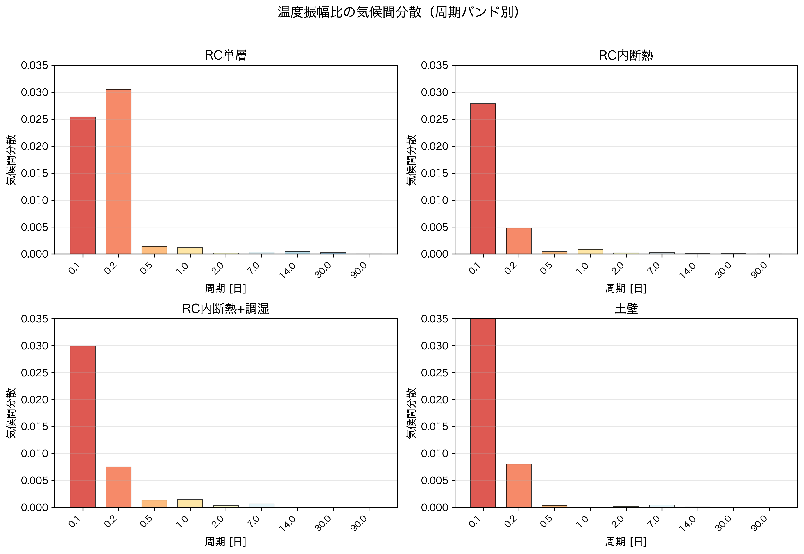
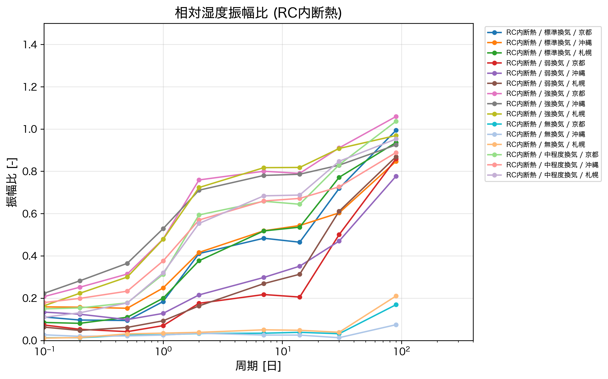
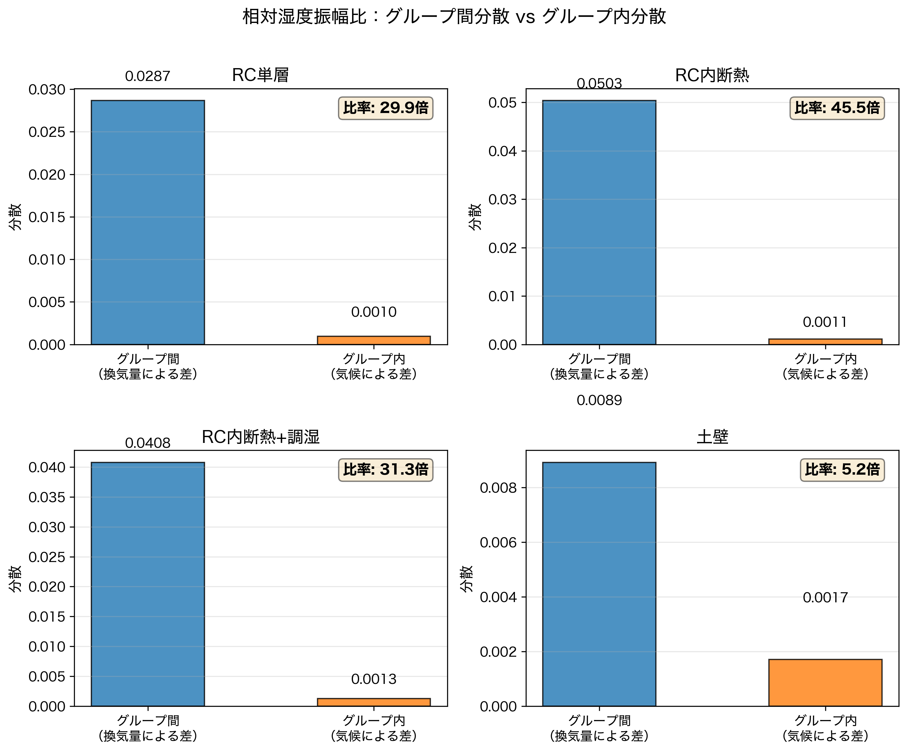
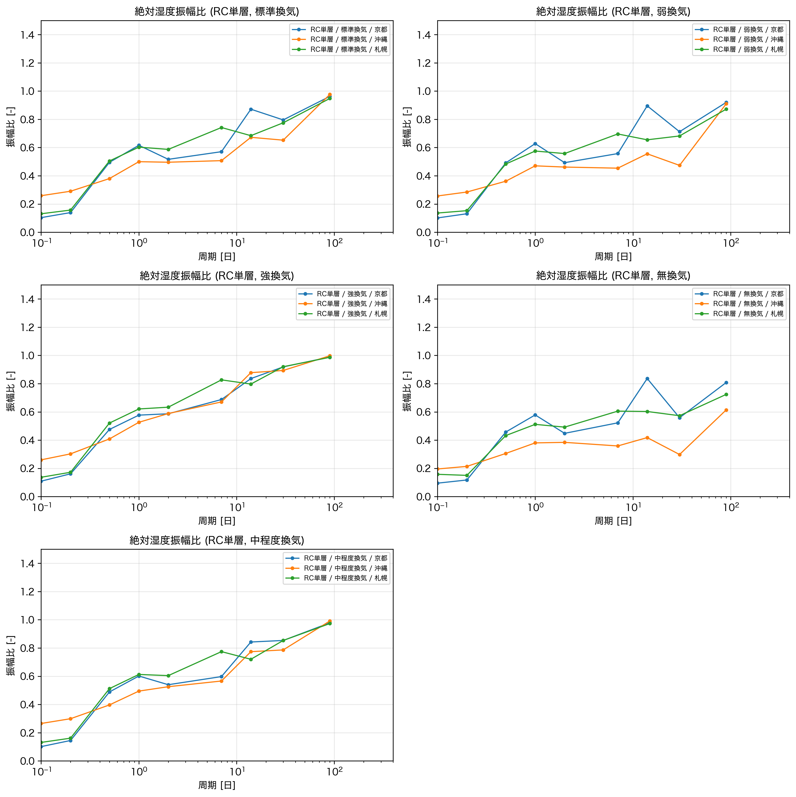
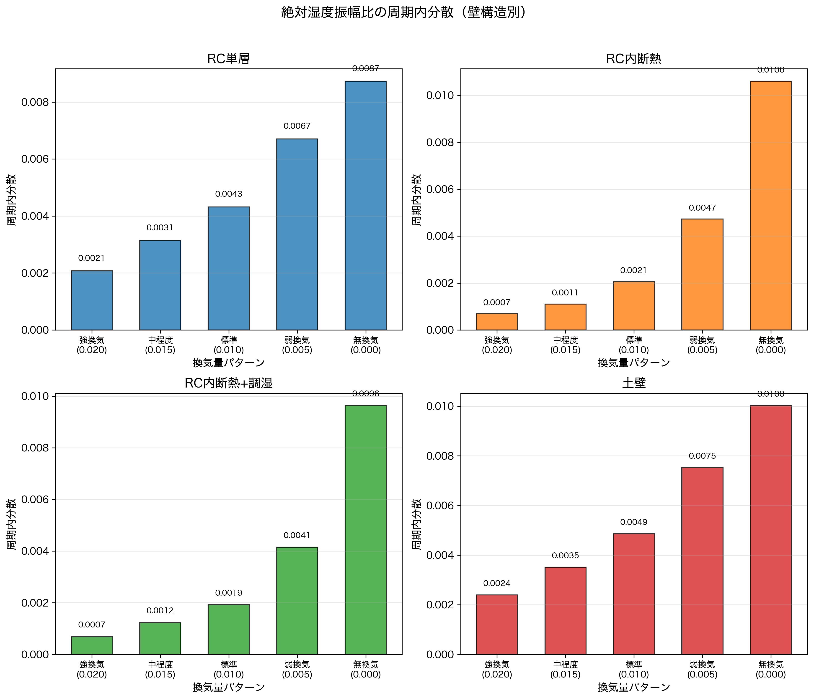

# 考察

## 本章の概要

　本章では、第6章で示した振幅比の解析結果に基づき、周波数特徴量から建物性能を逆推定する際の可能性と限界について考察する。

　第2章で述べたように、本研究の最終目標は機械学習による建物性能の逆推定である。この逆推定が成立するためには、周波数特徴量（振幅比・位相差）が建物性能の違いを反映していること、かつ気候条件などの外乱に対して頑健であることが求められる。第5章で導入した振幅比は、外気の絶対的な振幅に依存しないため、理論的には気候条件によらず建物固有の性能を反映することが期待された。しかし、第6章の結果を詳細に分析すると、この期待が常に成り立つわけではないことが明らかになった。

　本章では、振幅比の気候条件に対する頑健性を温度（7.2節）・相対湿度（7.3節）・絶対湿度（7.4節）それぞれについて定量的に検証する。最後に7.5節で本章の知見をまとめ、機械学習による逆推定への示唆を述べる。

　なお、第5章の式(5.8)で定義した振幅比は、室内と外気の振幅の比として計算されるため、外気振幅の絶対値には依存しない。したがって、同一の建物性能であれば、気候条件が異なっても振幅比は同じ値を示すことが期待される。以下では、京都・沖縄・札幌の3都市における振幅比を比較し、この期待がどの程度成り立つかを検証する。

## 温度振幅比の気候頑健性

### 気候条件による分離

　図7.1に、全壁構造・全換気量パターンにおける温度振幅比を気候条件別に示す。

**図7.1　温度振幅比（全条件・気候条件別）**

　図から明らかなように、短周期側（0.1〜0.5日付近）では温度振幅比が気候条件ごとに明確に分離している。札幌が最も上に位置し、次いで京都、沖縄の順となっている。同一の建物性能パターン（壁構造・換気量の組み合わせ）であっても、気候条件が異なれば振幅比は大きく異なる値を示す。一方、長周期側（2日以上）では全ての条件で振幅比が1に収束し、気候条件による差は消失する。

### 周期バンド別の気候間分散

　この観察を定量的に検証するため、各周期バンドにおける気候間分散を計算した。気候間分散$\sigma^2_{w,o,t}$は、壁構造$w$・換気量$o$・周期$t$の組み合わせにおける3都市間の振幅比の分散として、次式で定義される。

$$
\sigma^2_{w,o,t} = \mathrm{Var}_{c}(R_{w,o,t,c}) \qquad \text{(7.1)}
$$

ここで、$R$は振幅比、$c$は気候条件（京都・沖縄・札幌）を表す。図7.2に、各周期バンドでの気候間分散を壁構造別に示す。なお、各周期バンドの値は全換気量パターンで平均した値である。

**図7.2　温度振幅比の気候間分散（周期バンド別）**

　全ての壁構造において、短周期（0.1〜0.2日）では気候間分散が0.025〜0.045と大きいのに対し、長周期（2日以上）では0.001以下とほぼゼロに近い値となっている。すなわち、温度振幅比の気候依存性は周期に強く依存しており、短周期ほど気候条件の影響を受けやすい。

### 逆推定への示唆

　この結果は、温度振幅比を特徴量として用いる機械学習モデルの汎化性能に重要な示唆を与える。例えば、京都の気象データで学習したモデルを札幌の建物に適用した場合、同じ建物性能であっても短周期の振幅比が異なるため、誤った推定結果を導く可能性が高い。すなわち、**温度振幅比は気候条件に対して頑健ではなく、単一気候で学習したモデルを他の気候条件に直接転用することは困難である**。

　この限界を克服するためには、以下のようなアプローチが考えられる。

1. **気候条件ごとのモデル構築**：各気候条件に特化したモデルを個別に学習する
2. **気候正規化**：外気温の統計量（平均、分散など）を用いて振幅比を正規化する
3. **転移学習**：複数気候のデータで事前学習し、対象気候でファインチューニングする

　ただし、いずれのアプローチも追加のデータや計算コストを要するため、温度振幅比のみに依存した逆推定手法には本質的な限界があることを認識する必要がある。

## 相対湿度振幅比の気候頑健性

### 換気量によるグループ化

　図7.3に、RC内断熱における相対湿度振幅比を示す。グラフには5種類の換気量パターンと3都市の組み合わせ、計15本の線が含まれている。

**図7.3　相対湿度振幅比（RC内断熱・全換気量・全気候）**

　図から、換気量ごとに5つのグループが形成されていることが読み取れる。各グループ内には3本の線（3都市）が含まれており、これらは完全には一致していない。すなわち、相対湿度振幅比にも気候条件による差は存在する。しかし、温度振幅比（図7.1）と比較すると、**グループ間の距離（換気量による差）がグループ内のばらつき（気候による差）よりも大きい**ことが見て取れる。

### グループ間分散とグループ内分散

　この観察を定量的に検証するため、グループ間分散とグループ内分散を計算した。グループ間分散$\sigma^2_{\mathrm{between}}$は各換気量の平均振幅比の分散（換気量による差を反映）、グループ内分散$\sigma^2_{\mathrm{within}}$は各換気量内での気候間分散の平均（気候による差を反映）であり、それぞれ次式で定義される。

$$
\sigma^2_{\mathrm{between},w,t} = \mathrm{Var}_{o}(\bar{R}_{w,o,t}) \qquad \text{(7.2)}
$$

$$
\sigma^2_{\mathrm{within},w,t} = \frac{1}{|\mathcal{O}|} \sum_{o \in \mathcal{O}} \mathrm{Var}_{c}(R_{w,o,t,c}) \qquad \text{(7.3)}
$$

ここで、$\bar{R}_{w,o,t}$は換気量$o$における3気候の平均振幅比、$\mathcal{O}$は換気量パターンの集合である。図7.4に、これらを全周期で平均した値を壁構造別に示す。

**図7.4　相対湿度振幅比のグループ間分散とグループ内分散**

　全ての壁構造において、グループ間分散がグループ内分散を大きく上回っている。RC内断熱では約45倍、RC単層およびRC内断熱+調湿では約30倍、土壁でも約5倍の差がある。これは、気候条件が異なっていても換気量の違いを識別できる可能性を定量的に示している。

　この結果は機械学習による逆推定において有利に働く。温度振幅比では気候条件の影響が支配的であったため、単一気候で学習したモデルの転用は困難であった。一方、相対湿度振幅比では換気量の影響が相対的に大きいため、異なる気候条件間でも換気量の大小関係をある程度推定できる可能性がある。

## 絶対湿度振幅比の気候頑健性

### 換気量と気候間ばらつきの関係

　図7.5に、RC単層における絶対湿度振幅比を換気量別に示す。各サブプロットは換気量パターンに対応し、それぞれ3都市の結果を含んでいる。

**図7.5　絶対湿度振幅比（RC単層・換気量別）**

　図から、換気量が大きいパターン（強換気、中程度換気）では3都市の線がほぼ重なっているのに対し、換気量が小さいパターン（弱換気、無換気）では3都市の線が明確に分離していることがわかる。すなわち、**換気量が大きいほど気候条件による振幅比のばらつきが小さくなる**傾向が見られる。

### 定量的検証

　この傾向を定量的に検証するため、壁構造別・換気量別の気候間分散を計算した。気候間分散$\sigma^2_{w,o}$は、各周期における3都市間の振幅比の分散を全周期で平均した値として、次式で定義される。

$$
\sigma^2_{w,o} = \frac{1}{N} \sum_{t=1}^{N} \mathrm{Var}(R_{w,o,t,\mathrm{kyoto}}, R_{w,o,t,\mathrm{okinawa}}, R_{w,o,t,\mathrm{sapporo}}) \qquad \text{(7.4)}
$$

ここで、$N$は周期ビンの数である。図7.6にその結果を示す。

**図7.6　絶対湿度振幅比の気候間分散（壁構造別・換気量別）**

　全ての壁構造において、換気量が大きいほど分散が小さく、無換気で分散が最大となる単調な関係が確認できる。この傾向は壁構造によらず成立している。

　この現象は以下のように説明できる。換気量が大きい場合、室内空気は外気と頻繁に入れ替わるため、室内の絶対湿度は外気の変動にほぼ追従する。このとき振幅比は1に近づき、壁構造や気候条件の違いが振幅比に反映されにくくなる。一方、換気量が小さい場合は壁体の吸放湿性能が相対的に効いてくるため、壁構造や気候条件による差が拡大する。

　機械学習による逆推定の観点からは、この結果は二面性を持つ。

- **換気量の推定には有利**：振幅比の絶対値から換気量の大小を推定できる可能性がある。また、強換気条件では気候間ばらつきが小さいため、異なる気候条件間での汎化が期待できる。
- **強換気建物での壁構造推定には不利**：強換気では条件間の差が小さくなり、壁構造の識別が困難になる。
