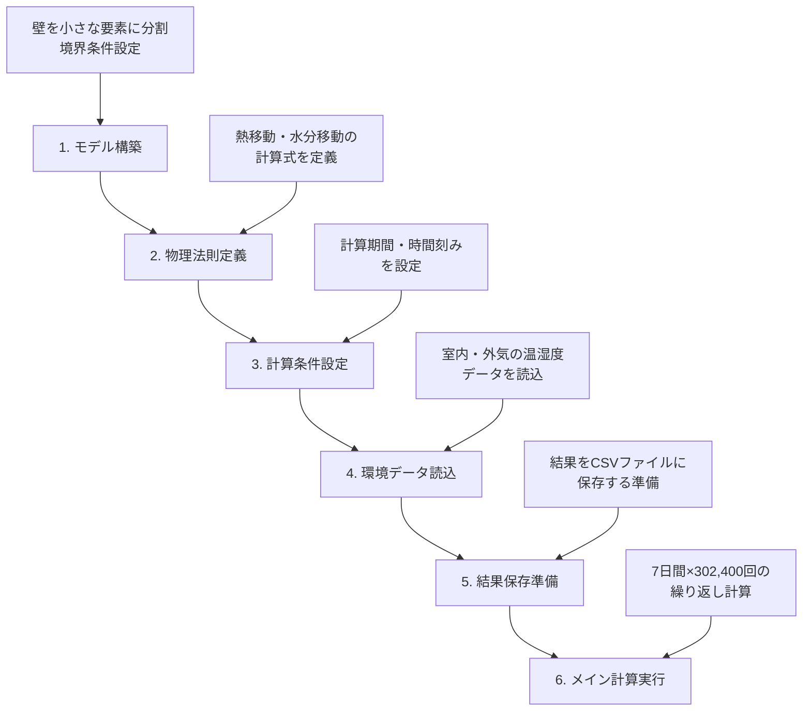
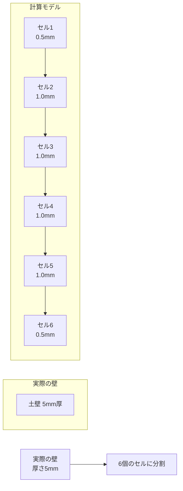
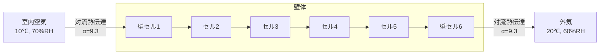
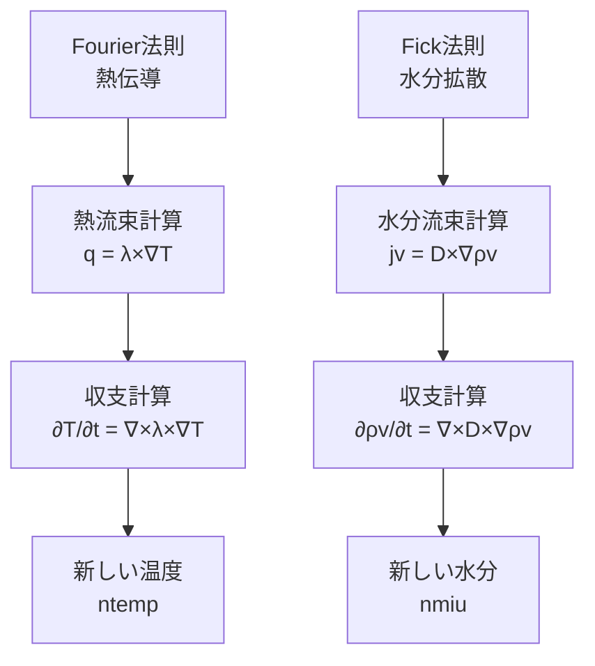
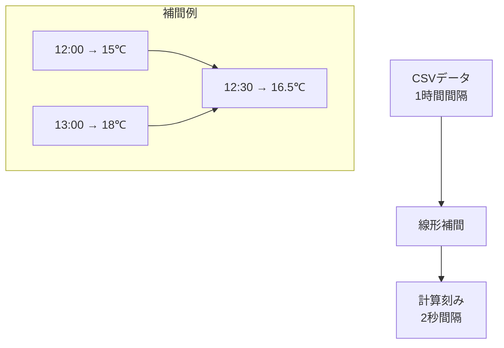
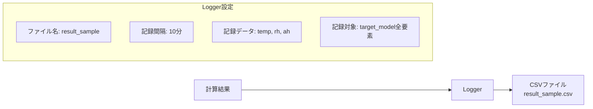
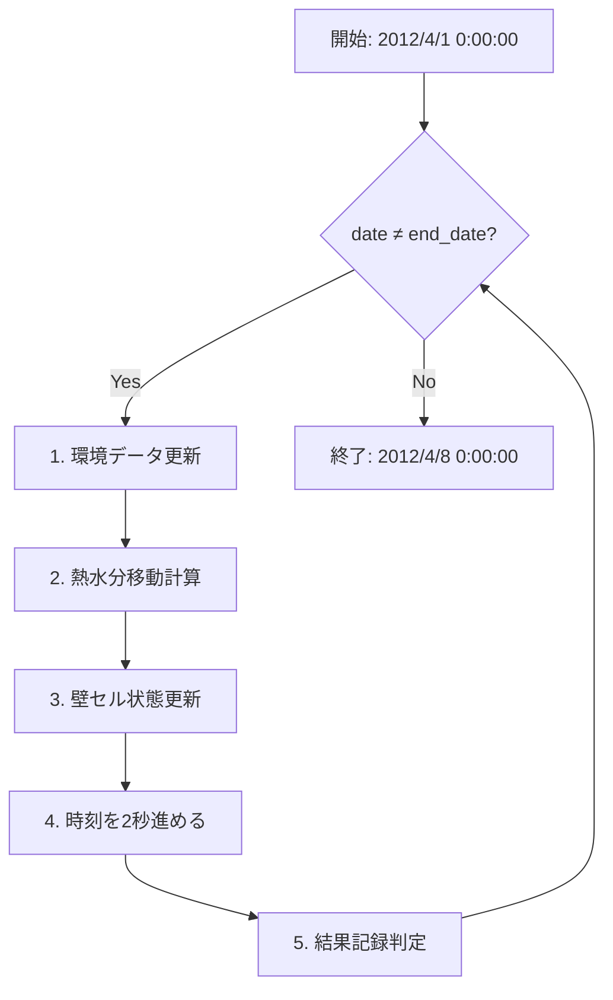
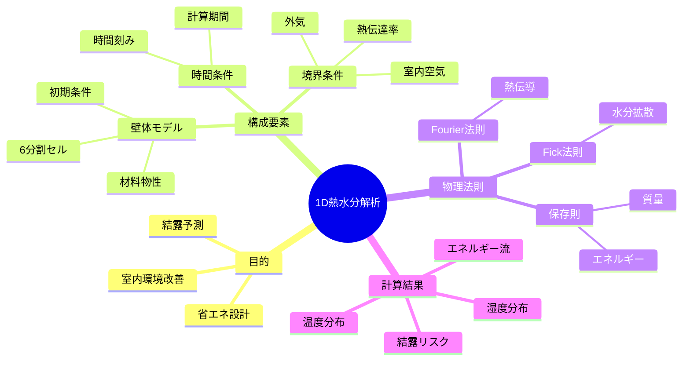

# 1D熱水分同時移動解析 完全理解ガイド

## 🎯 全体像：そもそも何をしているのか？

### 研究の目的
建物の壁の中で**熱（温度）**と**水分（湿度）**がどのように移動するかを、コンピュータで精密に計算し、**結露**などの問題を予測する研究です。

### 具体的な例
```
🏠 実際の問題
冬の朝、窓ガラスに水滴がつく（結露）
↓
なぜ起こる？どう防ぐ？
↓
💻 コンピュータシミュレーション
壁の中の温度・湿度変化を詳細計算
↓
🔬 結果
結露が起こる条件、対策方法を発見
```

---

## 🧩 全体の流れ：6つのステップ



---

## 📁 関連ファイル構造

```
📁 プロジェクトルート/
├── 📄 1D_calculation.ipynb           ★メイン実行ファイル
├── 📄 logger.jl                      ★結果保存機能
├── 📁 module/                         ★計算エンジン群
│   ├── 📄 cell.jl                    (壁の要素定義)
│   ├── 📄 air.jl                     (空気の物性)
│   ├── 📄 boundary_condition.jl      (境界条件)
│   ├── 📄 transfer_in_media.jl       (熱水分移動計算)
│   ├── 📄 climate.jl                 (気象データ処理)
│   └── 📁 material_property/          ★材料データベース
│       ├── 📄 mud_wall.jl            (土壁の物性)
│       ├── 📄 metal_plate.jl         (金属板の物性)
│       ├── 📄 glass_wool_16K.jl      (グラスウールの物性)
│       └── 📄 ... (40+ materials)
├── 📁 input_data/                     ★入力データ
│   ├── 📁 climate_data/              (気象データ)
│   │   └── 📄 sample_climate_data.csv
│   └── 📁 1D_model/                  (壁体構成データ)
└── 📁 output_data/                    ★計算結果
    └── 📄 result_sample.csv          (計算結果CSV)
```

---

## 🏗️ ステップ1：モデル構築（セル[7]-[13]）

### 1.1 壁の分割



**セル[7]で決定されるもの：**
```julia
L = 6           # 分割数：6個のセル
width = 0.005   # 壁厚：5mm
wall = [Cell() for i = 1:L]  # 6個の空容器を作成
```

### 1.2 各セルの詳細設定

**セル[8]で決定されるもの：**
```julia
for i = 1:L
    wall[i].i = [i, 1, 1]                    # 位置情報
    wall[i].dx = ...                         # セル幅
    wall[i].temp = 10.0 + 273.15            # 初期温度：10℃
    wall[i].rh = 0.6                         # 初期湿度：60%
    wall[i].material_name = "mud_wall"       # 材料：土壁
end
```

### 1.3 境界条件の設定



**セル[10]-[11]で決定されるもの：**
```julia
# 室内側境界条件
air_in.air.temp = 10.0 + 273.15  # 室内温度
air_in.air.rh = 0.7               # 室内湿度
air_in.alpha = 9.3                # 熱伝達率

# 外気側境界条件  
air_out.air.temp = 20.0 + 273.15  # 外気温度
air_out.air.rh = 0.6               # 外気湿度
air_out.alpha = 9.3                # 熱伝達率
```

### 1.4 完全なモデルの結合

**セル[13]で決定されるもの：**
```julia
target_model = vcat(air_in, wall, air_out)
# [1:室内] [2:セル1] [3:セル2] [4:セル3] [5:セル4] [6:セル5] [7:セル6] [8:外気]
```

---

## ⚙️ ステップ2：物理法則定義（セル[16]）

### 2.1 熱水分移動の物理法則



**セル[16]で定義される関数：**
```julia
function cal_new_temp_miu_neumann(target_model, dt)
    # 1. 流量計算
    q = [cal_q(target_model[i], target_model[i+1]) for i = 1:7]     # 熱流束
    jv = [cal_jv(target_model[i], target_model[i+1]) for i = 1:7]  # 水蒸気流束
    jl = [cal_jl(target_model[i], target_model[i+1], 0.0) for i = 1:7] # 液水流束
    
    # 2. 収支計算  
    ntemp = [cal_newtemp(...) for i = 1:6]  # 新温度
    nmiu = [cal_newmiu(...) for i = 1:6]    # 新水分化学ポテンシャル
    
    return ntemp, nmiu
end
```

### 2.2 隣接要素間の相互作用

```
隣接セル間の流束計算:
┌─────┐    q[1]    ┌─────┐    q[2]    ┌─────┐
│室内 │ =========> │セル1│ =========> │セル2│ ...
│空気 │    jv[1]   │     │    jv[2]   │     │
└─────┘            └─────┘            └─────┘

q: 熱流束 [W/m²]
jv: 水蒸気流束 [kg/m²s]
```

---

## ⏰ ステップ3：計算条件設定（セル[19]）

### 3.1 時間に関する設定

**計算時間の設定:**

```
開始時刻: 2012/4/1 0:00:00
時間刻み: dt = 2.0秒 (高精度計算)
終了時刻: 2012/4/8 0:00:00
計算期間: 7日間 = 168時間 = 604,800秒
総ステップ数: 604,800÷2 = 302,400ステップ
```

**セル[19]で決定されるもの：**
```julia
dt = 2.0                           # 時間刻み：2秒
date = DateTime(2012,4,1,0,0,0)    # 開始：2012年4月1日0時
end_date = DateTime(2012,4,8,0,0,0) # 終了：2012年4月8日0時
```

---

## 🌤️ ステップ4：環境データ読込（セル[22],[24]）

### 4.1 気象データファイルの構造

```
sample_climate_data.csv:
日時,温度,湿度,気圧,降水,日射,風速,風向,放射,透過率,雲量
2012/1/1 0:00,3.7,77,,,0,1.3,北,,,
2012/1/1 1:00,3.9,74,,,0,1.3,北,,,
2012/1/1 2:00,3.7,76,,,0,1.9,北北東,,,
...
```

### 4.2 気象データの時間補間



**セル[22],[24]で決定されるもの：**
```julia
# 室内側気象データ
climate_data_in = input_climate_data("sample_climate_data.csv", header=3)
climate_data_in.air = air_in.air

# 外気側気象データ  
climate_data_out = input_climate_data("sample_climate_data.csv", header=3)
climate_data_out.air = air_out.air
```

---

## 💾 ステップ5：結果保存準備（セル[27]）

### 5.1 ロガーの設定



**セル[27]で決定されるもの：**
```julia
logger_room = set_logger(
    "result_sample",           # ファイル名
    10.0,                      # ロギング間隔：10分
    ["temp","rh","ah"],        # 記録データ種類
    target_model               # 記録対象
)
```

### 5.2 出力CSVファイルの構造

```csv
時刻, 室内_temp, 室内_rh, 室内_ah, セル1_temp, セル1_rh, セル1_ah, ..., 外気_temp, 外気_rh, 外気_ah
2012/04/01 00:00, 10.0, 70.0, 0.00532, 10.0, 60.0, 0.00453, ..., 20.0, 60.0, 0.00692
2012/04/01 00:10, 10.1, 69.8, 0.00531, 10.2, 59.9, 0.00454, ..., 19.8, 60.1, 0.00691
...
```

---

## 🔄 ステップ6：メイン計算実行（セル[29]）

### 6.1 計算ループの全体構造



### 6.2 各ステップの詳細

#### ステップ1：環境データ更新
```julia
reset_climate_data(climate_data_in)   # 室内環境更新
reset_climate_data(climate_data_out)  # 外気環境更新
```

```
現在時刻に対応する温湿度を自動取得:
2012/4/1 12:30:00 → 温度・湿度を線形補間で取得
↓
air_in.air.temp, air_in.air.rh 更新
air_out.air.temp, air_out.air.rh 更新
```

#### ステップ2：熱水分移動計算
```julia
ntemp, nmiu = cal_new_temp_miu_neumann(target_model, dt)
```

```mermaid
flowchart LR
    A[現在の温湿度分布] --> B[流束計算]
    B --> C[収支計算]
    C --> D[新しい温湿度分布]
    
    subgraph 流束計算
        E[熱流束 q[1]~q[7]]
        F[水蒸気流束 jv[1]~jv[7]]
        G[液水流束 jl[1]~jl[7]]
    end
    
    subgraph 収支計算
        H[熱収支 → 新温度]
        I[水分収支 → 新水分]
    end
```

#### ステップ3：壁セル状態更新
```julia
for i = 1:length(wall)
    wall[i].temp = ntemp[i]  # 温度更新
    wall[i].miu = nmiu[i]    # 水分化学ポテンシャル更新
end
```

#### ステップ4：時刻進行
```julia
date = date + Millisecond(dt*1000)  # 2秒進める
climate_data_in.date = date         # 気象データの時刻同期
climate_data_out.date = date
```

#### ステップ5：結果記録
```julia
if mod(minute(date), 5) == 0 && second(date) == 0 && millisecond(date) == 0
    write_data_to_logger(logger_room, date)  # 5分ごとに記録
end
```

---

## 📊 計算結果の意味と活用

### 7.1 実行結果の例

**進捗表示：**
```
2012/04/01 00:00 外気：温度3.7[℃] 湿度0.77[-]
2012/04/02 00:00 外気：温度6.7[℃] 湿度0.68[-]  
2012/04/03 00:00 外気：温度17.1[℃] 湿度0.63[-]
2012/04/04 00:00 外気：温度8.6[℃] 湿度0.39[-]
2012/04/05 00:00 外気：温度11.5[℃] 湿度0.5[-]
2012/04/06 00:00 外気：温度14.1[℃] 湿度0.45[-]
2012/04/07 00:00 外気：温度11.0[℃] 湿度0.38[-]
```

### 7.2 温度分布の時間変化（想定）

```mermaid
graph TD
    subgraph "初期状態 t=0"
        A1[室内10℃] --> A2[セル1: 10℃] --> A3[セル2: 10℃] --> A4[セル3: 10℃] --> A5[セル4: 10℃] --> A6[セル5: 10℃] --> A7[セル6: 10℃] --> A8[外気20℃]
    end
    
    subgraph "1日後 t=24h"
        B1[室内10℃] --> B2[セル1: 12℃] --> B3[セル2: 13℃] --> B4[セル3: 15℃] --> B5[セル4: 16℃] --> B6[セル5: 17℃] --> B7[セル6: 18℃] --> B8[外気20℃]
    end
    
    subgraph "7日後 t=168h"
        C1[室内10℃] --> C2[セル1: 11℃] --> C3[セル2: 13℃] --> C4[セル3: 15℃] --> C5[セル4: 16℃] --> C6[セル5: 17℃] --> C7[セル6: 19℃] --> C8[外気20℃]
    end
```



### 7.3 結露リスクの評価

**結露発生条件：**
```
表面温度 < 露点温度 → 結露発生

例：
室内空気: 10℃, 70%RH → 露点温度 = 4.8℃
壁内表面温度: 8℃
→ 8℃ > 4.8℃ → 結露なし ✅

壁内表面温度: 3℃  
→ 3℃ < 4.8℃ → 結露発生 ⚠️
```

### 7.4 CSVデータの活用

**Excel/Pythonでの分析例：**
```python
import pandas as pd
import matplotlib.pyplot as plt

# データ読み込み
df = pd.read_csv('output_data/result_sample.csv')

# 温度分布のグラフ化
plt.plot(df['時刻'], df['セル1_temp'], label='外気側表面')
plt.plot(df['時刻'], df['セル6_temp'], label='室内側表面')
plt.legend()
plt.title('壁表面温度の時間変化')
plt.show()
```

---

## 🔧 初心者向け：改造・応用のポイント

### 8.1 材料を変更したい場合

**手順：**
1. `module/material_property/`で使用可能材料を確認
2. セル[8]の`material_name`を変更

```julia
# 土壁 → グラスウールに変更
wall[i].material_name = "glass_wool_16K"  # 断熱材
```

### 8.2 壁厚を変更したい場合

**手順：**
セル[7]の`width`を変更

```julia
width = 0.1  # 5mm → 100mm（厚い壁）
```

### 8.3 境界条件を変更したい場合

**手順：**
セル[10],[11]の温湿度・熱伝達率を変更

```julia
# より寒い外気条件
air_out.air.temp = -5.0 + 273.15  # -5℃
air_out.air.rh = 0.8               # 80%RH
```

### 8.4 計算期間を変更したい場合

**手順：**
セル[19]の期間を変更

```julia
date = DateTime(2012,12,1,0,0,0)     # 冬季計算
end_date = DateTime(2012,12,31,0,0,0) # 1ヶ月計算
```

---

## 🚀 次のステップ：より高度な解析

### 9.1 3D解析への拡張
- `3D_calculation.ipynb`を使用
- 角部・開口部の詳細解析
- より複雑な形状に対応

### 9.2 建物全体解析
- `network_calculation.ipynb`を使用  
- 複数室+換気システム
- 建物全体のエネルギー解析

### 9.3 実測データとの比較
- 実際の建物でのセンサー測定
- シミュレーション精度の検証
- モデルの改良・校正

---

## 📋 まとめ：全体の理解チェックリスト



### ✅ 理解度チェック

- [ ] 壁をセルに分割する理由が分かる
- [ ] 境界条件の物理的意味が分かる  
- [ ] 時間発展計算の流れが分かる
- [ ] 気象データの役割が分かる
- [ ] 結果の解釈方法が分かる
- [ ] パラメータ変更の影響が想像できる

**このガイドを通じて、1D熱水分解析の全体像から詳細まで、初心者でも理解できるように体系的に説明しました。実際のコード実行時は、このガイドを参照しながら進めることで、各ステップの意味と目的を明確に理解できます。**