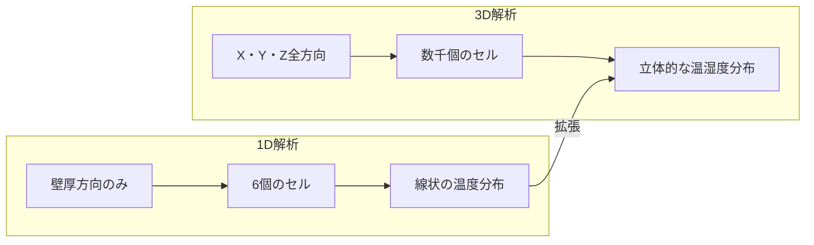
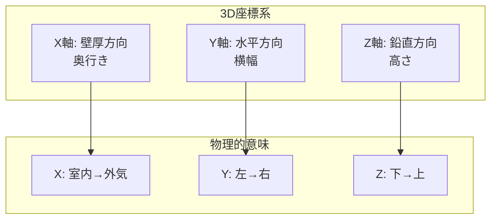
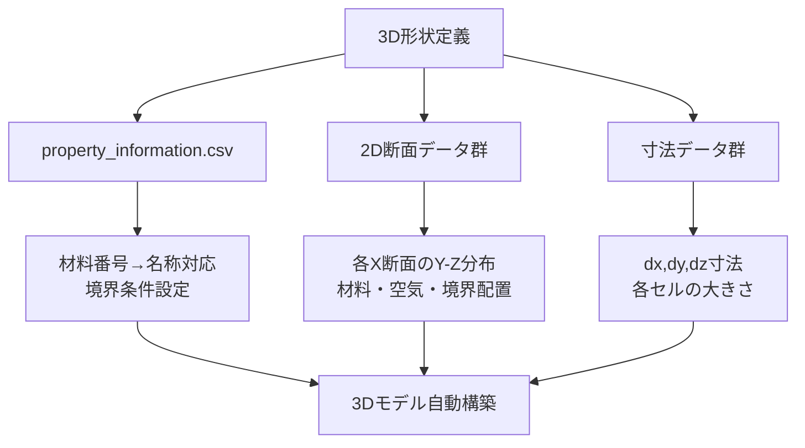
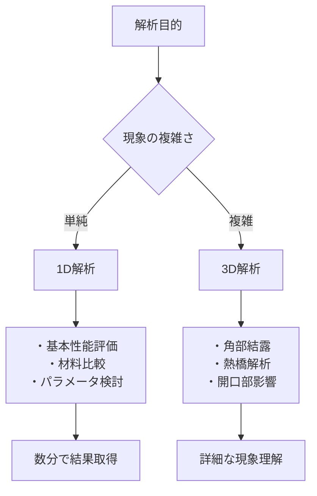
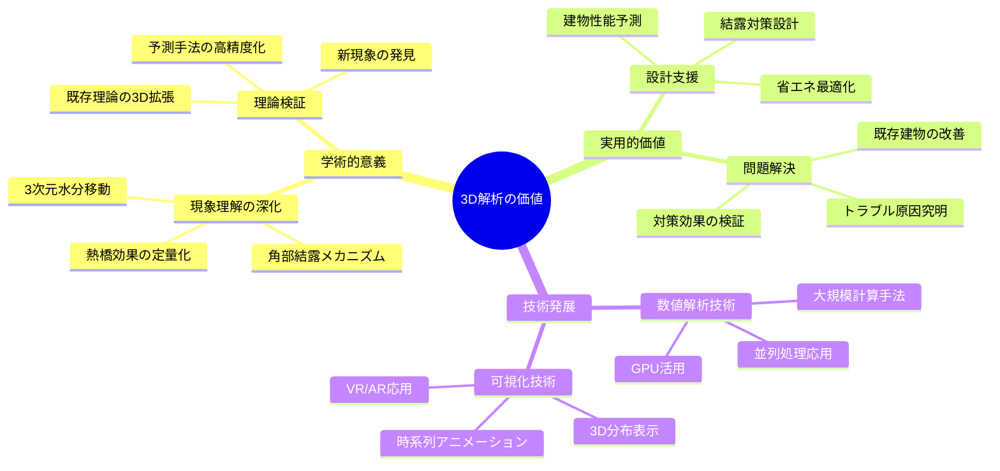

# 3D熱水分同時移動解析 完全理解ガイド

## 🎯 全体像：1D解析から3D解析への飛躍

### 3D解析の目的
1D解析では捉えられない**複雑な3次元現象**を精密に解析します：
- **角部結露**：壁・天井・床の接合部での水分集中
- **熱橋効果**：構造体貫通部での熱損失
- **開口部影響**：窓・ドア周辺の温湿度分布
- **非均質材料**：複数材料が混在する複雑構造

### 1D vs 3D の違い



---

## 🏗️ 3D解析の基本構造

### 1.1 座標系の定義



### 1.2 3次元格子構造

```
3次元セル配列: target_model[x,y,z]

Z軸(高さ)
↑
│   ┌─┬─┬─┬─┐
│   │  │  │  │  │
│   ├─┼─┼─┼─┤  
│   │  │  │  │  │
│   ├─┼─┼─┼─┤
│   │  │  │  │  │
│   └─┴─┴─┴─┘
└─────────────→ Y軸(幅)
  ／
 ／ X軸(奥行き)
```

---

## 📁 3D解析の入力ファイル構造

```
📁 input_data/3D_data/
├── 📄 property_information.csv        ★材料・境界条件定義
├── 📄 dx_data.csv                     ★X方向寸法情報
├── 📄 dy_data.csv                     ★Y方向寸法情報  
├── 📄 dz_data.csv                     ★Z方向寸法情報
├── 📄 3D_data_使い方.txt             ★データ作成指針
└── 📁 2D_property_data/               ★3D形状データ
    ├── 📄 2D_property_data.xlsx       (メインファイル)
    ├── 📄 2D_property_data_1.csv      (X=1断面)
    ├── 📄 2D_property_data_2.csv      (X=2断面) 
    ├── 📄 2D_property_data_3.csv      (X=3断面)
    └── 📄 ... (X=7断面まで)
```

### 入力データの階層構造



---

## 🔧 ステップ1：3Dモデル構築（セル[10]-[13]）

### 1.1 空気質点の定義（セル[10]）

```julia
# 空気を辞書型として定義
air = Dict()
air["air_in"]   = Air(name = "air_in",  temp = 10.0 + 273.15, rh = 0.6)  # 室内空気
air["air_mid"]  = Air(name = "air_mid", temp = 15.0 + 273.15, rh = 0.6)  # 中間空気
air["air_out"]  = Air(name = "air_out", temp = 20.0 + 273.15, rh = 0.6)  # 外気
```

**1Dとの違い：**
```
1D解析: 2つの境界条件（室内・外気）
3D解析: 複数の空気質点（室内・中間・外気・...）
```

### 1.2 3D読み込み関数（セル[12]）

**read_multi2D_geometry_data()関数の役割：**

```mermaid
flowchart LR
    A[2D断面データ<br/>×7枚] --> B[3D形状構築]
    C[property_information<br/>材料定義] --> B
    D[dx,dy,dz<br/>寸法情報] --> B
    
    B --> E[target_model[x,y,z]<br/>3次元配列完成]
```

**3Dモデル構築プロセス：**

```julia
function read_multi2D_geometry_data(file_number, temp_init, rh_init)
    # 1. 2D断面データ読み込み（Excel→3D配列）
    property_data[x,y,z] = 材料番号
    
    # 2. 材料情報読み込み
    property_info = CSV読み込み(property_information.csv)
    
    # 3. 寸法情報読み込み  
    dx_data, dy_data, dz_data = CSV読み込み
    
    # 4. 3D構造体配列作成
    target_model[x,y,z] = Cell() or BC_Robin() or BC_Neumann()
    
    # 5. 各要素の詳細設定
    for x,y,z in 全格子点
        材料名・寸法・初期条件・境界条件設定
    end
end
```

### 1.3 property_information.csvの構造

| number | name | alpha | alphac | alphar | 説明 |
|--------|------|-------|--------|--------|------|
| 0 | empty | 0 | 0 | 0 | 空要素 |
| 10 | BC_Neumann | 0 | 0 | 0 | 第2種境界条件 |
| 20 | air_in | 0 | 4.9 | 4.4 | 室内空気 |
| 30 | air_out | 0 | 4.9 | 4.4 | 外気 |
| 101 | mud_wall | 0 | 0 | 0 | 土壁材料 |
| 102 | plywood | 0 | 0 | 0 | 合板材料 |

### 1.4 2D断面データの例

**2D_property_data_1.csv (X=1断面):**
```
30,30,30,30,30    ← Y方向（横）：外気境界
30,30,30,30,30
101,101,101,101,101   ← 土壁材料
101,101,101,101,101
20,20,20,20,20    ← 室内空気境界
↑
Z方向（縦）
```

**意味：**
```
Z=5: 外気境界（air_out）
Z=4: 外気境界  
Z=3: 土壁材料（mud_wall）
Z=2: 土壁材料
Z=1: 室内境界（air_in）
```

---

## ⚙️ ステップ2：3D物理法則定義（セル[16]）

### 2.1 3D流束計算の複雑化

**1D解析（1方向）:**
```julia
q = [cal_q(target_model[i], target_model[i+1]) for i = 1:7]  # 7個の流束
```

**3D解析（3方向）:**
```julia
# X方向流束
qx[x,y,z] = cal_qx(target_model[x,y,z], target_model[x+1,y,z])
# Y方向流束  
qy[x,y,z] = cal_qy(target_model[x,y,z], target_model[x,y+1,z])
# Z方向流束
qz[x,y,z] = cal_qz(target_model[x,y,z], target_model[x,y,z+1])
```

### 2.2 3次元収支計算

```mermaid
graph TD
    A[セル[x,y,z]] --> B[X方向流束収支]
    A --> C[Y方向流束収支]
    A --> D[Z方向流束収支]
    
    B --> E[qx[x-1,y,z] - qx[x,y,z]]
    C --> F[qy[x,y-1,z] - qy[x,y,z]]
    D --> G[qz[x,y,z-1] - qz[x,y,z]]
    
    E --> H[3D収支方程式]
    F --> H
    G --> H
    
    H --> I[新しい温度・水分]
```

**3D収支式：**
```julia
# 熱収支
ntemp = cal_newtemp(
    dqx = (qx[x-1,y,z] - qx[x,y,z]),      # X方向熱流束差
    dqy = (qy[x,y-1,z] - qy[x,y,z]),      # Y方向熱流束差  
    dqz = (qz[x,y,z-1] - qz[x,y,z]),      # Z方向熱流束差
    djvx, djvy, djvz,                      # 各方向水蒸気流束差
    dt                                     # 時間刻み
)

# 水分収支
nmiu = cal_newmiu(
    djwx = (jvx + jlx)[x-1,y,z] - (jvx + jlx)[x,y,z],  # X方向水分流束差
    djwy = (jvy + jly)[x,y-1,z] - (jvy + jly)[x,y,z],  # Y方向水分流束差
    djwz = (jvz + jlz)[x,y,z-1] - (jvz + jlz)[x,y,z],  # Z方向水分流束差  
    dt
)
```

### 2.3 境界条件の複雑化

**1D解析:** 2つの境界面（左右）
**3D解析:** 6つの境界面（上下左右前後）+ 内部空気質点

```
6面の境界条件:
┌─────────┐  上面（Z=max）
│         │
│ 内部空気 │  Y方向境界面
│         │  
└─────────┘  下面（Z=1）
前面   後面
(X=1) (X=max)
```

---

## ⏰ ステップ3：計算条件設定（セル[20]-[22]）

### 3.1 時間設定の違い

```julia
# 開始時刻
date = DateTime(2004,8,1,0,0,0)

# 終了時刻（短期間テスト）
end_date = DateTime(2004,8,1,0,10,0)  # 10分間

# 時間刻み
dt = 1.0  # 1秒（3D計算は重いため大きめ）
```

**1Dとの比較：**
```
1D解析: dt=2秒, 7日間（実用的計算）
3D解析: dt=1秒, 10分間（テスト・検証用）
```

### 3.2 計算負荷の違い

```
計算量の比較:
1D: 8要素 × 302,400ステップ = 約240万計算
3D: 数千要素 × 600ステップ = 数百万〜数千万計算

→ 3D解析は計算時間が大幅増加
```

---

## 🌤️ ステップ4：気象データ読込（セル[24]-[26]）

### 4.1 複数空気質点への対応

```julia
# 室内側気象データ
climate_data_in.air = air["air_in"]

# 外気側気象データ  
climate_data_out.air = air["air_out"]

# 中間空気は固定値（簡略化）
# air["air_mid"] は時間変化なし
```

**1Dとの違い：**
- 1D: 2つの境界条件のみ
- 3D: 複数空気質点（一部は時間変化、一部は固定）

---

## 💾 ステップ5：結果保存（セル[38]）

### 5.1 3D分布データの保存

**1D解析:**
```
単一CSVファイル: result_sample.csv
列数: 8要素 × 3データ = 24列
```

**3D解析:**
```
複数ファイル: temp_data_月_日_時_分.csv
内容: 3次元分布データ（X,Y,Z,値）
出力頻度: 10分ごと
```

### 5.2 出力ファイル構造

```csv
# temp_data_8_1_0_10.csv の例
x=2
2,2,2,25.3     # X=2, Y=2, Z=2, 温度=25.3℃
2,2,3,25.1     # X=2, Y=2, Z=3, 温度=25.1℃
2,3,2,25.4     # X=2, Y=3, Z=2, 温度=25.4℃
...
x=3
3,2,2,24.8     # X=3, Y=2, Z=2, 温度=24.8℃
...
```

---

## 🔄 ステップ6：メイン計算実行（セル[38]）

### 6.1 3D計算ループの構造

```mermaid
flowchart TD
    A[date ≠ end_date?] -->|Yes| B[1. 気象データ更新]
    B --> C[2. 3D流束計算<br/>qx,qy,qz / jvx,jvy,jvz / jlx,jly,jlz]
    C --> D[3. 3D収支計算<br/>ntemp,nmiu]
    D --> E[4. 全セル状態更新<br/>target_model[x,y,z]]
    E --> F[5. 時刻を1秒進める]
    F --> G[6. 3D分布データ保存<br/>10分ごと]
    G --> A
    A -->|No| H[計算終了]
```

### 6.2 3D状態更新の複雑化

```julia
# 3重ループによる全セル更新
for x = 2:length(target_model[:,1,1])-1
    for y = 2:length(target_model[1,:,1])-1  
        for z = 2:length(target_model[1,1,:])-1
            if typeof(target_model[x,y,z]) == Cell
                target_model[x,y,z].temp = ntemp[x-1,y-1,z-1]
                target_model[x,y,z].miu = nmiu[x-1,y-1,z-1]
            elseif typeof(target_model[x,y,z]) == BC_Robin
                # 空気質点の更新
                target_model[x,y,z].air.temp = ntemp[x-1,y-1,z-1]
                target_model[x,y,z].air.rh = convertMiu2RH(...)
            end
        end
    end
end
```

---

## 📊 3D解析結果の可視化と解釈

### 7.1 ヒートマップ表示（セル[40]）

```julia
# Y-Z断面（X=4）の温度分布
Y = 2:length(target_model[1,:,1])-1
Z = 2:length(target_model[1,1,:])-1
value = [temp(target_model[4,y,z]) for y in Y, z in Z]

# ヒートマップ作成
heatmap(value, title="X=4断面の温度分布")
```

### 7.2 3D分布の特徴

**温度分布例:**
```
Z軸(高さ)方向の温度勾配:
┌─────────────┐ Z=上 (高温)
│   25.3℃     │
├─────────────┤ Z=中
│   24.8℃     │  
├─────────────┤ Z=下 
│   24.2℃     │
└─────────────┘ Z=底 (低温)

Y軸(幅)方向は比較的均一
X軸(奥行き)方向に大きな勾配
```

### 7.3 実用的な解析ポイント

**角部結露の検出:**
```
target_model[角部X, 角部Y, 角部Z]の温度
< 露点温度
→ 結露発生リスク
```

**熱橋効果の評価:**
```
構造体貫通部周辺の温度分布
→ 局所的な低温部の特定
→ 断熱改善箇所の特定
```

---

## 🔧 1D解析との詳細比較

### 8.1 機能比較表

| 項目 | 1D解析 | 3D解析 |
|------|--------|--------|
| **対象現象** | 壁厚方向の基本移動 | 3次元複雑現象 |
| **格子数** | 8要素（固定） | 数千要素（可変） |
| **入力方法** | 手動設定（簡単） | ファイル群（複雑） |
| **計算時間** | 数分 | 数時間〜数日 |
| **結果出力** | 1つのCSV | 複数の3Dデータ |
| **可視化** | 線グラフ | ヒートマップ・3D |
| **適用場面** | 基本性能評価 | 詳細現象解析 |

### 8.2 使い分けの指針



---

## 🎯 3D解析の実用的応用例

### 9.1 小型物置への適用

**1D解析での課題:**
```
🏠 小型物置の問題
├── 角部結露 ❌ (1D解析では捉えられない)
├── ドア枠周辺 ❌ (3次元効果)  
├── 床・壁接合部 ❌ (2次元以上の現象)
└── 基本壁性能 ✅ (1D解析で十分)
```

**3D解析での解決:**
```
📊 3D解析の適用
├── 角部温度分布 → 結露リスク評価
├── ドア開口影響 → 局所的な温湿度変化
├── 熱橋効果 → 構造体貫通部の熱損失
└── 全体最適化 → 統合的な対策設計
```

### 9.2 3D入力データの作成方法

**ステップ1: 形状設計**
```
CADソフト等で3D形状作成
↓
X方向に断面分割（例：7断面）
↓
各断面をY-Z平面の格子で表現
```

**ステップ2: プロパティ設定**
```
property_information.csv作成:
- 材料定義（番号→名称）
- 境界条件定義
- 熱伝達率設定
```

**ステップ3: 断面データ作成**
```
2D_property_data_1.csv〜7.csv作成:
- 各格子点に材料番号割り当て
- 空気部分・境界部分・材料部分を区別
```

**ステップ4: 寸法データ作成**
```
dx_data.csv, dy_data.csv, dz_data.csv作成:
- 各方向の格子間隔設定
- 境界付近は細かく、中央部は粗く
```

---

## 🚀 次のステップ：高度な3D解析

### 10.1 複雑形状への対応

```
現在: 直方体ベースの単純形状
↓
発展: 曲面・斜面を含む複雑形状
- より細かい格子分割
- 境界条件の高精度化
- 計算アルゴリズムの最適化
```

### 10.2 多物理連成解析

```
基本: 熱 + 水分移動
↓  
発展: 熱 + 水分 + 空気流動 + 構造変形
- CFD解析との連成
- 構造解析との連成  
- より現実的な現象再現
```

### 10.3 実測検証の重要性

```
シミュレーション精度向上:
1. 実建物での多点温湿度測定
2. 3D解析結果との詳細比較
3. モデル校正・パラメータ調整
4. 予測精度の定量評価
```

---

## 📋 まとめ：3D解析マスターへの道

### ✅ 理解度チェックリスト

**基礎レベル:**
- [ ] 1D→3Dへの拡張の意味が分かる
- [ ] 3次元座標系（X,Y,Z）の物理的意味が分かる
- [ ] 入力ファイル群の役割が理解できる
- [ ] 3D流束計算の考え方が分かる

**中級レベル:**
- [ ] property_informationファイルが作成できる
- [ ] 2D断面データが設計できる
- [ ] 計算結果の3D可視化ができる
- [ ] 角部・熱橋現象の解釈ができる

**上級レベル:**
- [ ] 独自の3D形状データが作成できる
- [ ] 複雑な境界条件が設定できる
- [ ] 計算結果から実用的な対策が提案できる
- [ ] 実測との比較検証ができる

### 🎯 実践プロジェクト提案

**初級プロジェクト:**
```
既存データの改造:
1. property_informationの材料変更
2. 寸法データの修正
3. 境界条件の変更
4. 短時間計算での動作確認
```

**中級プロジェクト:**
```
小型物置3D解析:
1. 物置形状の3Dデータ作成
2. 角部・開口部を含むモデル化
3. 結露リスク評価
4. 改善案の提案
```

**上級プロジェクト:**
```
実建物の詳細解析:
1. 実測データとの比較検証
2. 複雑な3D形状の高精度モデル化
3. 年間シミュレーション
4. 省エネ・結露対策の最適設計
```

---

## 🔬 3D解析の科学的意義

### 建築物理学への貢献



**3D熱水分解析は、建築物理学における最先端の研究手法として、より安全で快適、かつ省エネルギーな建物の実現に貢献する重要な技術です。**

このガイドを通じて、1D解析の基礎から3D解析の高度な応用まで、段階的に理解を深め、実践的なスキルを身につけることができます。