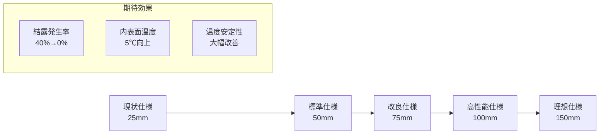
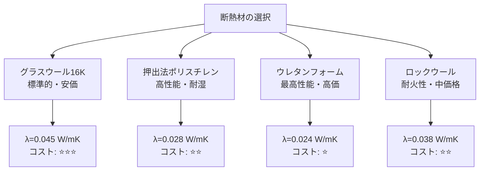
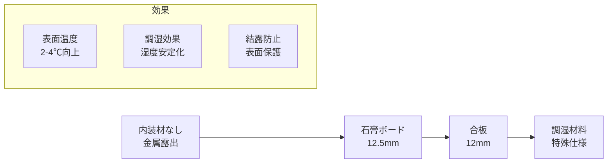

# 小型物置1D解析：パラメータスタディ提案書

## 🎯 パラメータスタディの目的

小型物置の熱水分性能を体系的に評価し、**結露対策**と**省エネ性能**を両立する最適仕様を見つけ出すための包括的なパラメータ検討を行います。

---

## 📊 パラメータ比較早見表

| パラメータ項目 | 変更方法 | 検討パターン数 | 期待される効果 | 優先度 | 実施順序 |
|---------------|----------|----------------|----------------|--------|----------|
| **断熱材厚さ** | セル[7] width変更 | 5パターン | 結露リスク大幅改善 | ⭐⭐⭐ | 1番目 |
| **断熱材種類** | セル[8] material_name変更 | 4パターン | 性能・コスト最適化 | ⭐⭐⭐ | 2番目 |
| **内装材仕様** | セル[8] 材料追加/変更 | 4パターン | 表面結露防止 | ⭐⭐ | 3番目 |
| **境界条件** | セル[10,11] 温湿度変更 | 3パターン | 厳しい条件での検証 | ⭐⭐ | 4番目 |
| **換気条件** | 気象データ変更 | 3パターン | 実使用条件の評価 | ⭐ | 5番目 |
| **計算期間** | セル[19] 期間変更 | 2パターン | 季節変動の把握 | ⭐ | 6番目 |

**総計算回数：** 約25-30回の解析実行  
**所要時間：** 約2-3日（解析+分析込み）  
**期待成果：** 小型物置の最適設計指針確立

---

## 🔥 詳細1：断熱材厚さの系統的検討

### 検討の背景
小型物置の最大の問題は**結露**です。特に金属外壁による熱橋効果で内表面温度が低下し、収納物品に水分被害をもたらします。断熱材厚さは最も効果的な対策手段です。

### パラメータ設定



### 具体的な変更方法

**セル[7]で変更：**
```julia
# パターン1: 薄断熱（現状想定）
width = 0.025  # 25mm

# パターン2: 標準断熱
width = 0.050  # 50mm

# パターン3: 改良断熱  
width = 0.075  # 75mm

# パターン4: 高性能断熱
width = 0.100  # 100mm

# パターン5: 理想断熱
width = 0.150  # 150mm
```

### 評価指標と期待結果

```
📈 評価指標:
├── 結露発生率（%）: 内表面温度 < 露点温度の時間割合
├── 最低内表面温度（℃）: 冬季の最低到達温度
├── 温度変動幅（K）: 日較差・季節変動の大きさ
├── 熱損失量（W/m²）: 平均的な熱流束
└── 材料コスト（円/m²）: 概算建設費用

📊 期待される結果の傾向:
25mm → 50mm: 結露発生率 40% → 25%（大幅改善）
50mm → 75mm: 結露発生率 25% → 15%（中程度改善）
75mm → 100mm: 結露発生率 15% → 8%（緩やかな改善）
100mm → 150mm: 結露発生率 8% → 3%（収穫逓減）
```

### 壁体構成の可視化

```
断熱材厚さ比較図:

パターン1（25mm）:
外気 ←→ 室内
┌─┬────┬─┐
│金│断熱材│露│ ← 結露リスク高
│属│25mm │出│
└─┴────┴─┘

パターン3（75mm）:  
外気 ←→ 室内
┌─┬─────────┬─┐
│金│  断熱材   │内│ ← バランス良好
│属│   75mm   │装│
└─┴─────────┴─┘

パターン5（150mm）:
外気 ←→ 室内  
┌─┬──────────────┬─┐
│金│     断熱材      │内│ ← 高性能だが厚い
│属│     150mm     │装│
└─┴──────────────┴─┘
```

---

## 🧱 詳細2：断熱材種類の性能比較

### 検討の背景
同じ厚さでも断熱材の種類により性能・コスト・施工性が大きく異なります。小型物置の用途・予算に最適な材料選択が重要です。

### パラメータ設定



### 具体的な変更方法

**セル[8]で変更：**
```julia
# パターンA: グラスウール（標準）
wall[i].material_name = "glass_wool_16K"

# パターンB: 押出法ポリスチレン  
wall[i].material_name = "extruded_polystyrene"

# パターンC: ウレタンフォーム
wall[i].material_name = "urethane_foam"  # 要確認

# パターンD: ロックウール
wall[i].material_name = "rock_wool"      # 要確認
```

### 材料特性比較表

| 材料名 | 熱伝導率<br/>(W/mK) | 透湿性 | 耐久性 | コスト<br/>(円/m²) | 特徴 |
|--------|---------------------|--------|--------|-------------------|------|
| **グラスウール16K** | 0.045 | 高い | 普通 | 3,000 | 標準的、施工容易 |
| **押出法ポリスチレン** | 0.028 | 低い | 高い | 5,000 | 耐湿性優秀 |
| **ウレタンフォーム** | 0.024 | 低い | 高い | 8,000 | 最高性能 |
| **ロックウール** | 0.038 | 中程度 | 高い | 4,000 | 耐火性、防音性 |

### 性能比較図

```
同一厚さ（50mm）での断熱性能比較:

グラスウール16K:
外気0℃ ←→ 室内10℃
┌────────────────┐
│ 温度勾配: 急峻    │ 
│ 内表面: 約5℃    │ ← 結露リスクあり
└────────────────┘

押出法ポリスチレン:
外気0℃ ←→ 室内10℃  
┌────────────────┐
│ 温度勾配: 緩やか  │
│ 内表面: 約7℃    │ ← 結露リスク軽減
└────────────────┘

ウレタンフォーム:
外気0℃ ←→ 室内10℃
┌────────────────┐  
│ 温度勾配: 最も緩やか │
│ 内表面: 約8℃    │ ← 結露リスク最小
└────────────────┘
```

---

## 🏠 詳細3：内装材仕様の結露対策効果

### 検討の背景
内装材は内表面温度の向上と調湿効果により、結露対策に大きな効果を発揮します。コストと効果のバランスを考慮した最適仕様を検討します。

### パラメータ設定



### 具体的な変更方法

**セル[8]で材料層を追加/変更：**

```julia
# パターンⅠ: 内装材なし（現状）
L = 6  # 金属+断熱材のみ
wall[6].material_name = "glass_wool_16K"  # 最内層が断熱材

# パターンⅡ: 石膏ボード仕上げ
L = 8  # 金属+断熱材+石膏ボード
wall[7].material_name = "plasterboard"
wall[8].material_name = "plasterboard"

# パターンⅢ: 合板仕上げ  
L = 8  # 金属+断熱材+合板
wall[7].material_name = "plywood"
wall[8].material_name = "plywood"

# パターンⅣ: 調湿材仕上げ
L = 8  # 金属+断熱材+調湿材
wall[7].material_name = "moisture_regulating_material"
wall[8].material_name = "moisture_regulating_material"
```

### 内装材の効果メカニズム

```
内装材の結露対策効果:

パターンⅠ（内装材なし）:
外気 ←→ 室内空気
┌─┬────┐  │
│金│断熱材│  │ 直接接触
│属│    │←─┤ 結露発生
└─┴────┘  │

パターンⅡ（石膏ボード）:
外気 ←→ 室内空気  
┌─┬────┬─┐ │
│金│断熱材│石│ │ 表面温度向上
│属│    │膏│←┤ 調湿効果
└─┴────┴─┘ │ 結露軽減

パターンⅢ（合板）:
外気 ←→ 室内空気
┌─┬────┬─┐ │  
│金│断熱材│合│ │ 表面温度向上
│属│    │板│←┤ 断熱効果
└─┴────┴─┘ │ 結露軽減

パターンⅣ（調湿材）:
外気 ←→ 室内空気
┌─┬────┬─┐ │
│金│断熱材│調│ │ 表面温度向上  
│属│    │湿│←┤ 優れた調湿効果
└─┴────┴─┘ │ 結露大幅軽減
```

### 内装材の特性比較

| 内装材 | 厚さ<br/>(mm) | 熱伝導率<br/>(W/mK) | 調湿性能 | コスト<br/>(円/m²) | 期待効果 |
|--------|---------------|---------------------|----------|-------------------|----------|
| **なし** | 0 | - | なし | 0 | 基準（結露リスク高） |
| **石膏ボード** | 12.5 | 0.22 | あり | 1,500 | 表面温度+3℃、調湿効果 |
| **合板** | 12 | 0.16 | 少し | 2,000 | 表面温度+4℃、断熱効果 |
| **調湿材料** | 10 | 0.20 | 優秀 | 4,000 | 表面温度+3℃、優れた調湿 |

### 予想される結果

```
📊 内装材による結露対策効果:

結露発生率の変化:
内装材なし: 35% → 石膏ボード: 20% → 合板: 15% → 調湿材: 8%

内表面温度の向上:
内装材なし: 基準 → 石膏ボード: +3℃ → 合板: +4℃ → 調湿材: +3℃

湿度安定性:
内装材なし: 変動大 → 石膏ボード: 安定 → 合板: やや安定 → 調湿材: 非常に安定

総合コストパフォーマンス:
石膏ボード > 合板 > 調湿材 > 内装材なし
```

---

## 🎯 推奨実施プロセス

### Phase 1: 基本性能把握（1-2日）
```
1. 断熱材厚さ3パターン（25mm, 50mm, 100mm）
2. グラスウール16Kで統一
3. 内装材なしで基本特性把握
→ 断熱効果の定量的評価
```

### Phase 2: 材料最適化（1日）
```
1. 最適厚さ（Phase1結果）で材料種類比較
2. グラスウール vs 押出法ポリスチレン vs その他
3. コストパフォーマンス評価
→ 最適材料の選定
```

### Phase 3: 仕上げ仕様検討（1日）
```
1. 最適材料・厚さで内装材比較
2. 石膏ボード vs 合板 vs 調湿材 vs なし
3. 結露対策効果の最終評価
→ 推奨仕様の確定
```

### Phase 4: 条件依存性確認（0.5日）
```
1. 厳しい外気条件での検証
2. 換気条件の影響確認
3. 季節変動の長期評価
→ 設計安全率の確認
```

---

## 📋 期待される最終成果

### 定量的成果
```
✅ 最適断熱材厚さの決定（結露発生率5%以下）
✅ 費用対効果最大の材料選定
✅ 内装仕様の効果定量化
✅ 設計指針の確立（寸法・材料・施工方法）
```

### 実用的価値
```
🏗️ 小型物置メーカーへの設計提案
📊 結露対策の技術資料作成
💰 コスト最適化データの提供
🔬 学術論文・学会発表への展開
```

この系統的なパラメータスタディにより、小型物置の結露問題を根本的に解決する最適設計指針を確立できます。