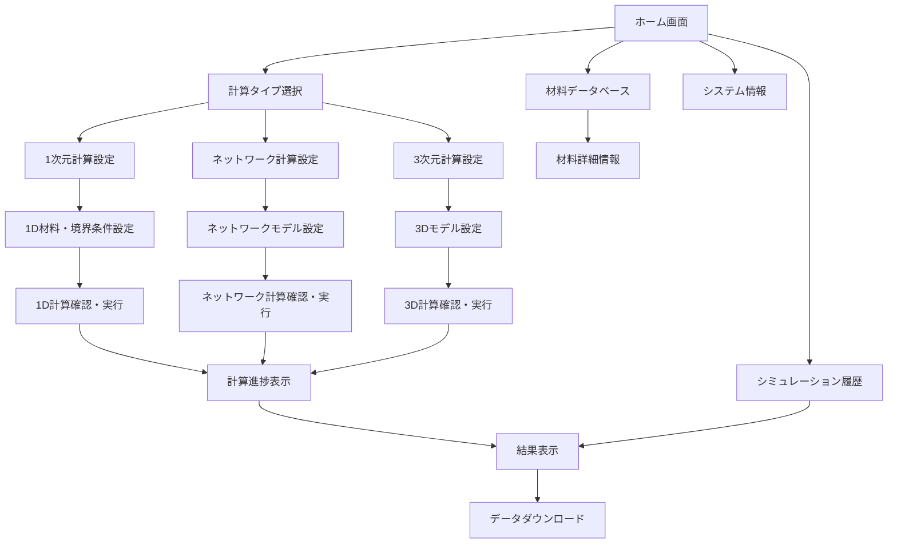
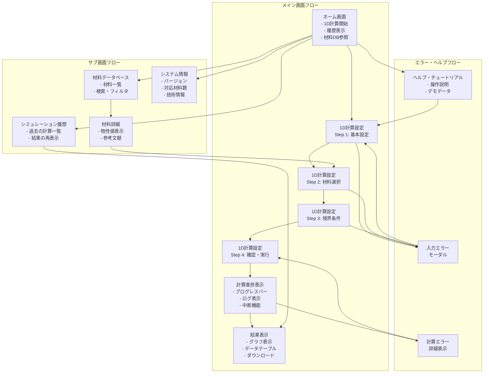

# 画面遷移図

## 全体画面構成

## 詳細画面遷移フロー

### Phase 1 対応範囲（1次元計算のみ）

## 各画面の役割と遷移条件

### 1. ホーム画面（トップページ）
**役割**: アプリケーションのエントリーポイント
**主要機能**:
- 新規計算の開始
- 過去のシミュレーション履歴表示
- 材料データベースへのアクセス
- システム情報表示

**遷移条件**:
- "新規計算開始" → 計算タイプ選択画面
- "履歴を見る" → シミュレーション履歴画面
- "材料を調べる" → 材料データベース画面
- "システム情報" → システム情報画面

### 2. 計算タイプ選択画面
**役割**: 計算方法の選択
**主要機能**:
- 1D/ネットワーク/3D計算の選択
- 各計算タイプの説明表示

**遷移条件**:
- Phase 1では1D計算のみ有効
- "1D計算" → 1D計算設定画面
- "戻る" → ホーム画面

### 3. 1D計算設定画面（4ステップ構成）

#### Step 1: 基本設定
**役割**: シミュレーション基本情報の設定
**主要機能**:
- シミュレーション名・説明の入力
- 計算期間の設定
- 時間刻みの設定

**遷移条件**:
- "次へ" → Step 2（入力検証後）
- "戻る" → 計算タイプ選択画面

#### Step 2: 材料選択・壁体構成
**役割**: 壁体の層構成と材料の設定
**主要機能**:
- 壁体層の追加・削除・並び替え
- 各層の材料選択
- 各層の厚さ・分割数設定
- 材料物性値の確認

**遷移条件**:
- "材料詳細を見る" → 材料詳細モーダル
- "次へ" → Step 3（構成検証後）
- "戻る" → Step 1

#### Step 3: 境界条件設定
**役割**: 室内外環境条件の設定
**主要機能**:
- 室内温湿度の設定
- 室外温湿度の設定
- 熱伝達率の設定
- 初期条件の設定

**遷移条件**:
- "次へ" → Step 4（物理的妥当性検証後）
- "戻る" → Step 2

#### Step 4: 確認・実行
**役割**: 設定内容の最終確認と計算開始
**主要機能**:
- 全設定内容の表示
- 推定計算時間・メモリ使用量の表示
- 設定変更リンク
- 計算開始ボタン

**遷移条件**:
- "計算開始" → 計算進捗表示画面
- "Step Xを編集" → 該当ステップに戻る
- "戻る" → Step 3

### 4. 計算進捗表示画面
**役割**: バックグラウンド計算の状況表示
**主要機能**:
- 進捗率の表示
- 推定残り時間の表示
- 計算ログのリアルタイム表示
- 計算中断機能

**遷移条件**:
- 計算完了時 → 結果表示画面（自動遷移）
- "中断" → 中断確認モーダル → ホーム画面
- 計算エラー時 → エラー詳細表示

### 5. 結果表示画面
**役割**: 計算結果の可視化と分析
**主要機能**:
- 温度・湿度変化グラフの表示
- グラフの拡大・縮小・パン操作
- 複数地点の同時表示
- データテーブル表示
- ダウンロード機能

**遷移条件**:
- "ダウンロード" → ファイルダウンロード処理
- "新しい計算" → ホーム画面
- "設定を変更して再計算" → 1D計算設定画面（設定値継承）

### 6. シミュレーション履歴画面
**役割**: 過去の計算結果の管理
**主要機能**:
- 計算履歴の一覧表示
- ステータス別フィルタ
- 結果の再表示
- 計算の削除

**遷移条件**:
- "結果を見る" → 結果表示画面
- "設定をコピーして新規計算" → 1D計算設定画面
- "戻る" → ホーム画面

### 7. 材料データベース画面
**役割**: 利用可能材料の閲覧
**主要機能**:
- 材料一覧の表示
- カテゴリ別フィルタ
- 材料名検索
- 基本物性値の表示

**遷移条件**:
- "詳細を見る" → 材料詳細画面
- "この材料で計算" → 1D計算設定画面（材料プリセット）
- "戻る" → ホーム画面

### 8. 材料詳細画面
**役割**: 特定材料の詳細情報表示
**主要機能**:
- 詳細物性値の表示
- 含水率関数のグラフ表示
- 参考文献の表示
- 適用範囲の表示

**遷移条件**:
- "この材料で計算" → 1D計算設定画面
- "戻る" → 材料データベース画面

### 9. システム情報画面
**役割**: アプリケーション情報の表示
**主要機能**:
- Juliaバージョン情報
- 対応材料数
- システム仕様
- 技術資料へのリンク

**遷移条件**:
- "戻る" → ホーム画面

## モーダル・ポップアップ画面

### エラー表示モーダル
- 入力エラー詳細
- 計算エラー詳細
- システムエラー詳細

### 確認モーダル
- 計算中断確認
- データ削除確認
- 設定リセット確認

### ヘルプモーダル
- 操作説明
- パラメータ説明
- エラー解決方法

## レスポンシブ対応

### PC版レイアウト
- サイドバーナビゲーション
- メインコンテンツエリア
- パンくずリスト

### タブレット版レイアウト（将来対応）
- ハンバーガーメニュー
- スワイプナビゲーション

### スマートフォン版（対応外）
- PC専用アプリケーションとして設計

## 状態管理

### グローバル状態
- 現在のシミュレーション設定
- ユーザーセッション情報
- 計算進捗状態

### ローカル状態
- 各画面のフォーム入力値
- UI表示状態（モーダル開閉等）
- 一時的なデータ

この画面遷移図により、ユーザーの操作フローが明確になり、各画面の責任範囲と連携方法が定義されます。